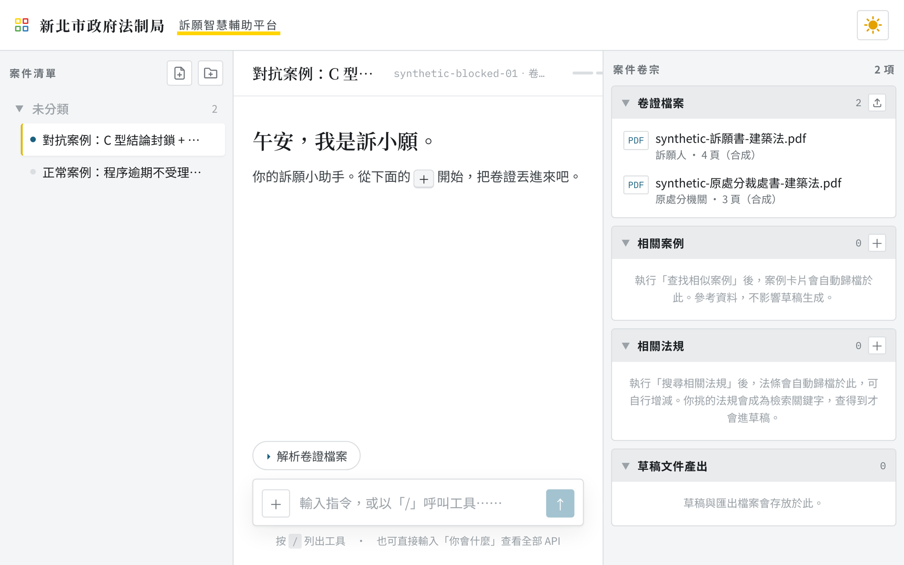

# 訴願智慧輔助平台

> 新北市政府法制局命題「訴願案件審理 AI 輔助」的 prototype（千山鳥飛絕 · 新北黑客松 2026）

給**訴願案件承辦人**用的辦案工作台。上傳卷證後，用對話交辦：解析卷證、算期間、查法條、
找相似決定、擬決定書草稿、匯出 PDF／Word。



<sub>本機 fixture 檔位實跑畫面，案件與卷證皆為合成測資（`synthetic-*`）。</sub>

它跟「叫模型寫一份決定書」的差別只有一句話——**它算得出來的自己算，算不出來的不猜，
寫出來的每一句都查得到出處**。

---

## 它幫承辦人做什麼

助理叫「訴小願」。左邊是案件清單，中間是對話串，右邊是案件卷宗——查到的法規、案例、
產出的草稿都自動歸檔到右欄，看得見也改得動。

**一件案子的動線**

```
上傳卷證 → 解析卷證檔案 → 查找相似案例／搜尋相關法規 → 生成草稿 → 優化文案 → 匯出 PDF／DOC
                                          ↘ 生成關聯圖（看結論是怎麼推出來的）
```

輸入框打 `/` 叫工具選單，或直接用中文說要什麼。

| 工具 | 做什麼 |
|---|---|
| **解析卷證檔案** | 讀完整份卷證，判斷案件類型，輸出事實經過、訴願主張、本案爭點與**程序審查結果** |
| **搜尋相關法規** | 撈法條、函釋與裁罰基準，標示現行有效版本，歸檔到右欄 |
| **查找相似案例** | 從歷史訴願決定書裡找性質相近的幾件，逐案標同異 |
| **生成草稿** | 以卷內事證與你挑的法規擬決定書，**逐句附引註，沒來源的話不寫** |
| **生成關聯圖** | 把卷證 → 事實 → 爭點 → 法規 → 結論畫成一張圖，標出引用有疑慮之處 |
| **優化文案** | 依指定方向修潤段落，引註保留 |
| **生成 PDF／DOC** | 套訴願決定書版型輸出，Word 檔可以直接接著改 |

工具會自己檢核前提：右欄還沒有法規與案例時，草稿生成會**拒絕執行並說缺什麼**，
不會自己補一份看起來很像的東西交差。

---

## 為什麼承辦人敢用

**一、期間計算可以當場驗算。**
30 天期間與訴願法第 77 條各款是**純規則引擎**算的，不經過模型：同樣的輸入永遠同樣的答案，
每一步算式攤開給人看，16 條測試向量把行為鎖住。
對 **251 件真實逾期訴願決定書**逐件回放，其中 175 件引擎可執行，**167 件可比對者全數與訴願審議委員會一致**
（屆滿日 38 件可比、28 件完全相符，差異多為「形式屆滿日 vs 行政程序法 §48 II 順延後屆滿日」的定義差異）。
**這批全是逾期案，所以量不到「把未逾期誤判成逾期」**——逐件報告見
[`docs/2026-09-12-deadline-parity-251.md`](docs/2026-09-12-deadline-parity-251.md)。

**二、引用查得到才算數。**
草稿裡每個法條與判解字號逐一比對法規快照，照實標成
`✓ 在庫`／`⚠ 已修正`／`◇ 庫外，未驗證`／`✗ 查無此號`／`？ 無法解析`。
**查無此號會讓送出直接被擋（HTTP 409）**，不是給你一個可以忽略的警告。
守門的是程式不是 AI——AI 最容易出包的就是編造判例，不能讓它自己查自己。

**三、不會的就不寫。**
需人工判斷的案件，結論段在送進模型**之前**就被拿掉，改出一張交接卡告訴你為什麼停在這裡；
不是叫模型「請不要寫結論」然後祈禱它聽話。
查詢也分得出「查了沒有」和「還沒查」——**還沒查不會被寫成查無**。

---

## 收錄範圍

| 用途 | 內容 |
|---|---|
| 相似案例檢索 | 2,448 件訴願決定書（新北全量 2,347 ＋ 歷史 101） |
| 參考資料檢索 | 19 筆司法院釋字與行政判解、10 則行政函釋 |
| 引用查證 | 11 部法規快照（`laws-snapshot.json`，只索引條號，不是法條全文） |

標「庫外，未驗證」代表**本系統無法驗證**，不代表該字號不存在；「對得回快照」也只代表字號存在，
不代表與本案相關——這兩條界線寫在畫面上，不藏在文件裡。

---

## 快速開始

需求：Python **3.10+**（macOS 內建 `/usr/bin/python3` 是 3.9，不夠）、Node 20+（只有前端要）。

```bash
# 1. 建前端（frontend/dist 不進 git）
#    VITE_API_MODE 預設是 mock，不設就會建出「整包在前端自己演」的版本，一次後端都不打
cd frontend && npx --yes pnpm@9 install --frozen-lockfile && \
    VITE_API_MODE=real npx --yes pnpm@9 run build && cd ..

# 2. 起服務（前端與 API 同一個 process）
uv run --python 3.11 --with-requirements backend/requirements.txt -- \
    python -m uvicorn backend.api.app:app --host 127.0.0.1 --port 8080
```

開 <http://127.0.0.1:8080/>。健康檢查在 `/api/health`（**真的**去載快照與案例，載不動回 503），
API 文件在 `/api/docs`。

預設是 **fixture 檔位**：不打任何雲端服務，附兩個合成案例
（`synthetic-ordinary-01`、`synthetic-blocked-01` 結論段被封鎖的案子）。
要真的呼叫模型就填好 `.env`（照 [`.env.example`](.env.example)）再起：

```bash
set -a; . ./.env; set +a     # RUN_MODE=bedrock、AWS_PROFILE、model id、KB id 都在裡面
uv run --python 3.11 --with-requirements backend/requirements.txt -- \
    python -m uvicorn backend.api.app:app --host 127.0.0.1 --port 8080
```

聊天追問只在 bedrock 檔位開放，fixture 檔位回 503——不假裝在跑。
只想跑產線不開服務：`python3 -m backend.cli --case synthetic-blocked-01`。

---

## 技術

**一句話：AI 在節點、程式在編排。** 流程是寫死的狀態機，六個節點裡只有兩個會呼叫基礎模型。

| 節點 | 對應畫面 | 用什麼 | 做什麼 |
|---|---|---|---|
| N1 抽取 | 收文書記官 | **LLM** | 讀 PDF 抽收文欄位，每欄帶信心值；沒把握就跳表單請人填 |
| N2 分類 | 分類調查官 | 純程式 | kNN 檢索投票定案型；跟 N1 讀出的不一致就停下來問人 |
| N3 程序審查 | 程序審查官 | 純程式 | 期間計算 ＋ 77 條款 if/else，算式全攤開 |
| N4 檢索 | 法規／案例比對官 | 純檢索 | 法條精確查表；相似案走 Bedrock KB，欄位比對標同異 |
| N5 主筆 | 書稿撰擬官 | **LLM** | 套模板，一句一個物件，每句自帶依據 |
| N6 守門 | 品管覆核官 | 純程式 | 逐句抽引用比對快照、C 型偵測 |

`N2/N3/N4/N6` 由 CI 靜態掃描（ast 遞迴）確保**不得直接或間接 import** `backend/llm/`、`boto3`、`strands`。
聊天走另一條路：一個帶八支工具的 agent，工具結果與引用狀態一律由後端決定，前端只照著顯示。

**棧**：FastAPI 單體（Python 3.10+，核心流程零外部依賴）＋ Vue 3 / Vite / Tailwind v4；
模型與檢索走 Amazon Bedrock ＋ Knowledge Bases；部署 AWS us-west-2，CloudFront → ALB → ECS Fargate（CDK）。

```bash
# 測試（2026-09-13 實跑：793/793 通過，另 5 項略過未執行並逐條列出）
uv run --python 3.11 --with-requirements backend/requirements.txt -- python backend/tests/run_all.py

# 部署
./infra/cdk/deploy.sh deploy     # 會自動建前端
./infra/cdk/verify.sh            # 五段驗收
```

**目錄**

```
backend/     api/ 端點｜orchestrator/ 編排（零 LLM）｜nodes/ 六節點｜engine/ 期間計算
             gate/ 引用狀態判定｜retrieval/ 查表＋KB｜llm/ 唯一可 import boto3/strands
frontend/    Vue 3 工作台（VITE_API_MODE=mock 可不接後端單跑）
infra/cdk/   CDK stack 與 deploy／verify 腳本
scripts/     KB 入庫、門檻量測、live 驗收、賽方測資評估
docs/ plans/ .prospec/   架構、ADR、spec、計畫與驗收證據
```

---

## 文件

[`CONSTITUTION.md`](CONSTITUTION.md)（九原則，紅線在這）→
[`docs/tech-stack-decision.md`](docs/tech-stack-decision.md)（ADR-001 選型）→
[`docs/architecture.md`](docs/architecture.md)（可施工規格）→
[`docs/spec/user-stories-ac.md`](docs/spec/user-stories-ac.md)（驗收 SOT）→
[`backend/DEPLOY.md`](backend/DEPLOY.md)（部署與踩過的坑）→
[`HANDOFF.md`](HANDOFF.md)（交接現況）。

## 紅線

- **賽方資料集「僅供競賽之用」**：不進 git、S3 不公開；repo 內只有衍生檔與 `synthetic-*` 合成測資。
- **secret 只在 `.env`／`~/.aws`**：帳號 id、model id、KB id、bucket 名不進程式與文件（有測試擋）。
- **只碰 AWS**：所有模型呼叫走 Bedrock，前端不得直連基礎模型。
- **資料來源限定政府公開來源**：全國法規資料庫／司法院系統與賽方資料集，商業平台的抓取程式碼不得進 repo。
