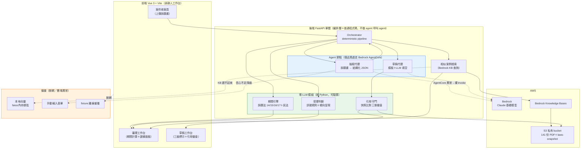
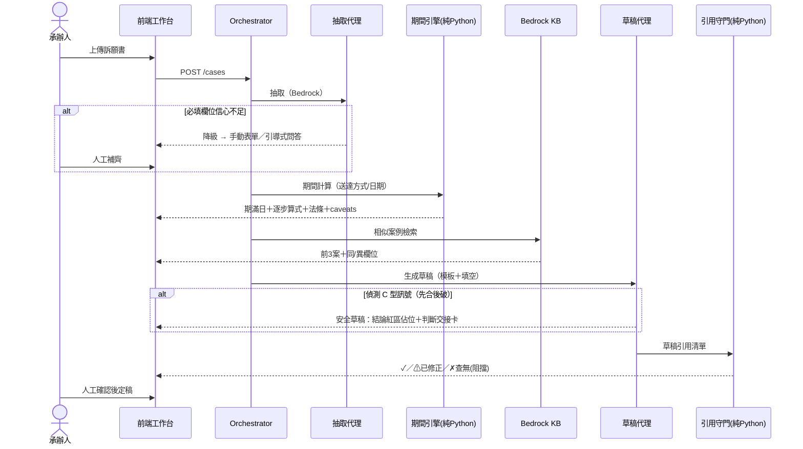
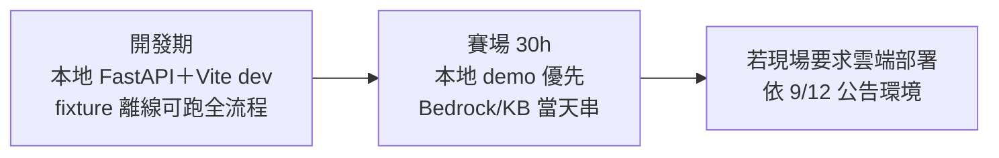

# 系統架構規劃（架構 survey，2026-08-30 會議用）

> 負責線：架構 survey → Ci（8/22 拍板）。本文承接 ADR-001（`docs/tech-stack-decision.md`）與
> `docs/spec/prototype-spec.md` §4.6 Multi-Agent 定調，並對 8/22 會議五個未解決議題提出建議案。
> 定位：30 小時賽制的單體架構，**agentic 在節點、deterministic 在編排**。

## 0. 白話版：這個系統在做什麼

把系統想成**一位新來的助理幕僚**；架構的核心是規定這位助理——哪些事可以自己做、
哪些事只能建議、哪些事絕對不准碰。承辦人上傳訴願書後，走一條產線：

1. **抽取代理（用 AI）**：把 PDF 讀懂，整理成表格——誰提的、哪天送達、什麼方式送達。沒把握讀對就不硬猜，跳出表單請人手動填。
2. **期間引擎（純程式，不用 AI）**：算「有沒有超過 30 天申訴期限」。純數學＋法條規則，同輸入永遠同答案，每步算式攤開。**demo 主秀**——可以驗算，承辦人才敢信。
3. **檢索（查資料庫）**：從 101 份決定書找 3 件最像的，逐案標「同/異」。只給參考，不說「本件應比照」。
4. **草稿代理（用 AI）**：套公文模板，AI 只填空。棘手案件**結論段留白**，附卡片列出要人決定的問題。
5. **引用守門（純程式，不用 AI）**：草稿引用的法條、判例字號逐一比對快照，查無即擋。**AI 最容易出包的就是編造判例，守門的絕不能是 AI 自己。**

兩個設計哲學：**AI 在節點、程式在編排**（流程寫死，AI 只在兩個工位上班）；**每層都有備援**（現場不賭任何外部服務）。
一句話：**AI 負責苦工、程式負責算數和把關、人負責判斷**——這個分工就是產品主張「承辦人敢用」。

## 1. 總覽架構圖

**看圖三句話**：
1. 綠區（零 LLM）是產品主張——可驗算、可攤開算式，LLM 永遠不碰計算與守門。
2. 藍區（Agent 節點）只有抽取與草稿兩處，各有輸出契約；編排層是普通程式碼。
3. 橘區備援每條都在 spec §7 有對應風險，demo 不賭在任何一個外部服務上。

## 2. 主流程時序（demo 走的那條線）

## 3. 五個未解決議題——建議案（今晚表態用）

### 3.1 embedding 選型：Bedrock KB（維持 ADR-001），正面回應準確度顧慮

**建議：委派 Bedrock KB，不自建。** Claire 的顧慮（委派犧牲準確度）成立於大語料場景，
但本案檢索母體只有 101 份決定書——這個量級下，勝負在 **metadata 過濾與呈現方式**，
不在 embedding 模型本身。補強做法：
- 入庫時附 metadata（案由分類／引用法條／處理結果），檢索用 filter 先縮小再算相似度
- 證據面板逐案標「同/異」，把準確度問題轉成人工可判——這本來就是產品主張
- 備援已定：KB 建不起來 → faiss 本地向量，介面不變（spec §7）

自建 vector DB 的 30 小時成本 ADR-001 已判死，不重開。

### 3.2 資料處理：簡易 POC 腳本，不上 ETL 框架

**建議：POC 腳本（Claire 案），但要求冪等。** Jacky「資料量會多」的前提在賽制下不成立——
資料已鎖定環境部單一領域（8/22 拍板），141 份 PDF 是天花板。
折衷：腳本放 `prototype/data/`，每支可重跑不壞（冪等），出錯砍掉重來的成本趨近於零。
若賽後要延續再談框架。

### 3.3 幕僚團角色：敘事五代理、實作兩節點

**建議：切五個敘事角色，對齊 §4.6 的實作邊界。**

| 敘事角色 | 實作 | 契約 |
|---|---|---|
| 抽取代理 | AgentCore 節點 | 訴願書 → 固定 JSON schema |
| 期間代理 | 純 Python（期間引擎） | 輸入結構化欄位 → 算式＋法條 |
| 檢索代理 | 普通程式碼（KB 查詢） | 案件特徵 → 前 3 案＋同/異 |
| 草稿代理 | AgentCore 節點 | 模板＋事實 → 草稿（C 型不寫結論） |
| 守門代理 | 純 Python（引用守門） | 草稿 → 三態徽章，✗ 阻擋送出 |

簡報上是「幕僚團」，工程上只有兩處真的呼叫 LLM——敘事成本為零、除錯地獄不進門。
Claire 原提案的「法官視角攻防」收斂為守門代理＋安全草稿的判斷交接卡，不做多輪 agent 對話。

### 3.4 受理判斷：訊號規則＋傾向呈現，不做硬分類

**建議：不輸出「受理／不受理」二元結論，輸出「傾向＋依據清單」。**
理由：分層誠實（憲法 §1）——受理判斷含法律涵攝，屬「請人工判斷」級。
系統列出程序訊號（期間是否逾期＝期間引擎可驗算、管轄機關比對、書件齊備檢查），
每條附依據，傾向交人拍板。這同時回答了「機率呈現」派的顧慮：不給假精確的百分比，
給的是可逐條核對的訊號。

### 3.5 抽取信心不足：手動表單為 baseline，引導式問答為 stretch

**釐清 spec 與會議紀要的不一致**：spec §4.2 寫「轉手動輸入表單」，會議傾向「問答式」。
**建議：表單是 baseline（v0 已有雛形、風險低），引導式問答列 stretch**——
問答式只是同一個降級路徑的更好 UI，資料流不變，baseline 全綠才做。spec 不用改，加一行 stretch 即可。

## 4. 部署形態（依 ADR-001，賽場 9/12 公告後再修）

- 前端不直連 Bedrock（憲法約束）；AWS 憑證只在後端 `.env`
- Bedrock KB 建庫留到賽場當天（8/22 拍板），賽前用 fixture＋faiss 開發

### 4.1 賽前先用什麼 infra（現在就能動工，當天搬過去）

原則：**搬遷＝換設定，不換程式。** LLM client 與 retriever 各留一個介面，`.env` 開關切換。

| 元件 | 賽前（現在） | 賽場當天 | 搬遷動作 |
|---|---|---|---|
| LLM 呼叫 | 自己 AWS 帳號的 Bedrock（少量調 prompt）＋fixture 回放為主 | 賽場環境的 Bedrock | `.env` 換憑證＋model id |
| 向量檢索 | faiss／內存餘弦（本地，不開雲） | Bedrock KB | `RETRIEVER=kb` 切旗標，介面不變 |
| 資料集 | 本機目錄（不進 git） | S3 私有 bucket → KB 建庫 | 跑入庫腳本（冪等） |
| 後端 | 本機 FastAPI（uvicorn） | 本機 demo 優先；雲端依 9/12 公告 | — |
| 前端 | Vite dev server | build 靜態檔，FastAPI 一起 serve | `vite build` |
| AgentCore | **先不包**，裸 Bedrock invoke 開發 | 現場可行才包 | 介面不變（§4.6 備援即裸 invoke） |

賽前唯一要開的雲資源是**自己帳號的 Bedrock**（開發期呼叫量小，成本可控），其餘全本地。
連 Bedrock 都可以最後才開——先用 fixture 假回應跑通整條產線，prompt 調校集中在最後幾天。

### 4.2 當天搬遷清單（目標 30 分鐘內）

1. `.env` 換賽場 AWS 憑證，smoke test 一次裸 invoke
2. 資料集上 S3 私有 bucket、跑 KB 建庫腳本（等 index 的空檔照常開發）
3. `RETRIEVER=kb` 切換，用 fixture 案跑主流程 end-to-end
4. 有餘裕才包 AgentCore；任一步卡住就停在備援檔位——faiss＋裸 invoke 的 demo 是完整的，不是殘缺版

## 5. 今晚要團隊表態的清單

1. §3.1–3.4 四個建議案，同意／修改（各 2 分鐘）
2. 8/22 待確認案：「一致性守門員＋草稿工作台」雙亮點定位——請四人明確表態（紀要列為 8/30 議程）
3. §3.5 只需知悉，不用決
