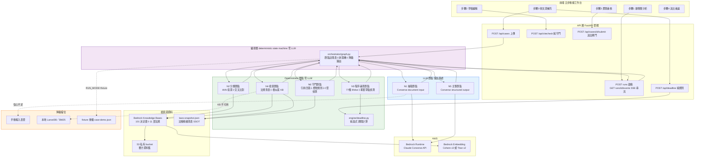
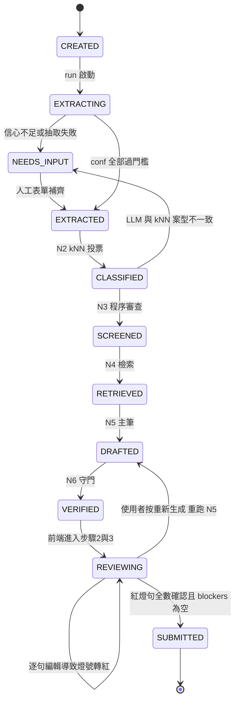
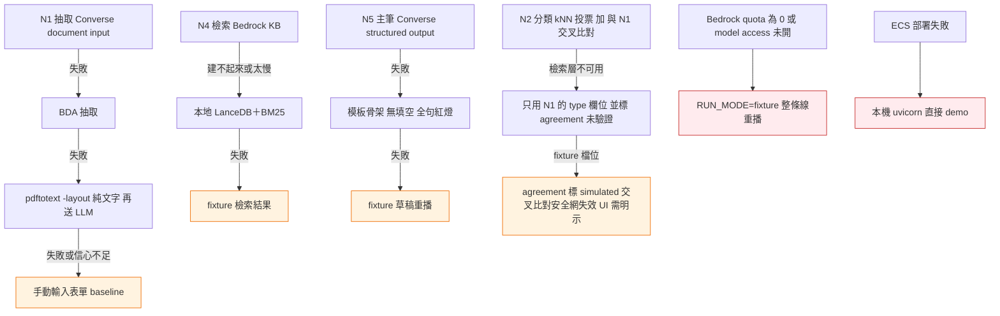
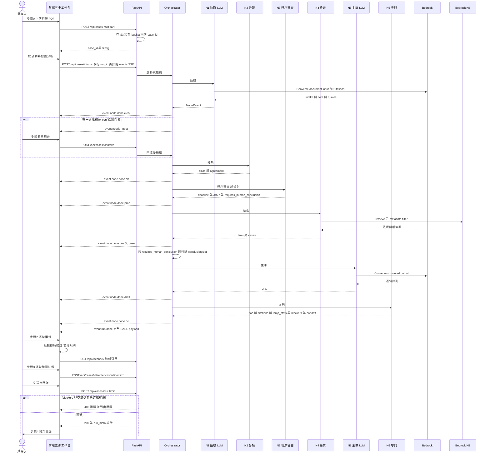
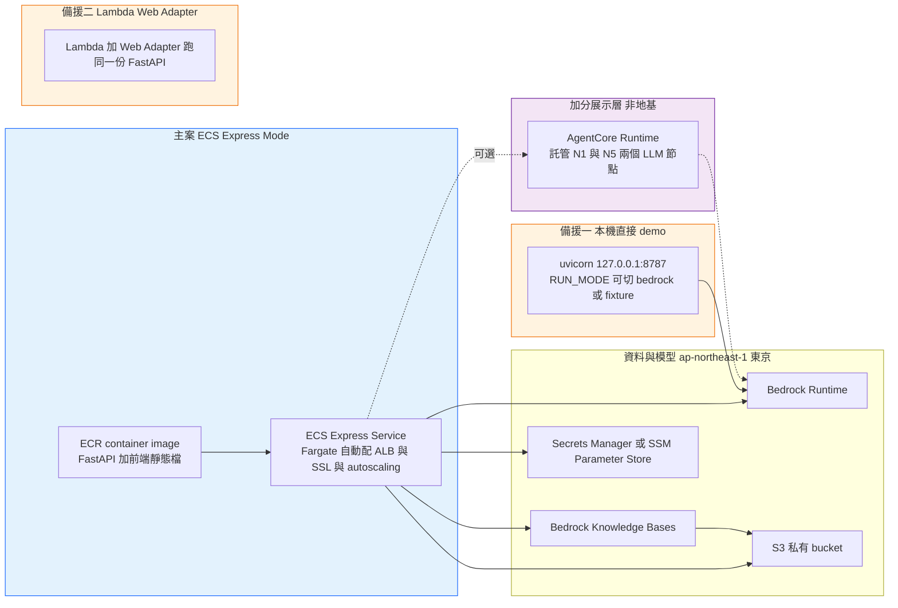

# 系統架構規劃（會後版 v2，2026-09-03）

> 上游文件：`docs/architecture-survey-2026-08-30.md`（8/30 會議用的 survey，本文承接其白話說明與設計哲學）、
> ADR-001（`docs/tech-stack-decision.md`）、`docs/spec/prototype-spec.md` §4.6、`CONSTITUTION.md`、
> `docs/spec/user-stories-ac.md`（驗收 SOT）。
> 定位：**這份是可施工的規格**，是接下來所有 `plans/` 與 Linear `HACK` issue 的上游。
> 基準：前端＝五步動線版（`origin/claude/prototype-update-ip99ix`）；後端要真的產出它期待的資料契約。
> 凡標「假設，待確認」「待實測」「未驗證」者，一律不得當成已定案往下推。

---

## 0. 白話版（會後版）

把系統想成**一間有七位幕僚的辦公室，但只有兩位幕僚會自己動筆**。承辦人上傳訴願卷證後，
案件在一條寫死的產線上依序經過六個工位，前端把它演成七位幕僚在依序報告：

1. **收文書記官（AI）**：讀 PDF，把「誰提的、哪天送達、什麼方式送達、原處分文號」填成表格。
   每個欄位帶一個信心值；沒把握就不硬猜，跳出表單請人手動填。**這是第一個、也是唯一一個用 AI 讀東西的地方。**
2. **分類調查官（純程式）**：拿抽取結果去 101 份歷史決定書裡找最像的鄰居，投票決定案型。
   投票結果若跟 AI 讀出來的案件類別不一致，直接停下來問人——**兩個獨立來源互相對照，就是安全網。**
3. **程序審查官（純程式，不用 AI）**：算「有沒有超過 30 天」。純數學＋法條規則，同輸入永遠同答案，
   每一步算式攤開給人看。**demo 主秀**——可以當場驗算，承辦人才敢信。
4. **法規檢索官／案例比對官（純檢索，不用 AI 生成）**：從法規庫撈條文原文，從 101 份決定書撈前 3 件最像的，
   逐案用欄位比對標「同哪裡、異哪裡」。只給參考，絕不說「本件應比照」。
5. **書稿撰擬官（AI）**：套決定書模板，AI 只負責把句子填進既定骨架，而且是**一句一個物件**地產出，
   每句自帶「我根據什麼寫的」。棘手案件的結論段**編排層根本不給它寫**——那個位置在送進模型前就被拿掉了。
6. **品管覆核官（純程式，不用 AI）**：草稿裡每個法條、判例字號逐一比對快照，查無就擋。
   燈號（紅／黃／綠）由規則判，不由 AI 判。**AI 最容易出包的就是編造判例，守門的絕不能是 AI 自己。**

三個設計哲學，比 8/30 版多了第三條：

- **AI 在節點、程式在編排**——流程寫死成一張圖，AI 只在兩個工位上班，而且是被叫進來、做完就走。
- **每層都有備援**——現場不賭任何一個外部服務；最壞情況整條產線用檔案重播，UI 一模一樣。
- **敘述不能比事實更漂亮**——前端那七張幕僚卡片上的每一句話，都是後端統計數字套模板產生的，
  不是模型自由發揮的文案。**8/30 展示版那七段敘述是預寫腳本，這一版必須把它變成真的。**

一句話：**AI 負責苦工、程式負責算數和把關、人負責判斷**——這個分工就是產品主張「承辦人敢用」。

---

## 1. 設計原則與硬約束：CONSTITUTION 八原則怎麼落到架構上

| # | 原則 | 架構上的落實機制 | 驗收方式 |
|---|---|---|---|
| 1 | 分層誠實 | 資料契約每個欄位標 `origin`（見 §6.4）：`rule`（規則產）／`retrieval`（檢索產）／`llm`（模型產）／`static`（設定）／`human`（人工填）／`record`（卷證直錄）。前端的**分層標示**（這句是誰產的）吃 `origin`；**燈號另走 `doc[].ss[].l`，由 N6 規則產**，兩者不是同一個欄位。無法歸類的欄位不得進 payload | §6.4 逐欄表；`scripts/contract_check.py` 掃 payload，出現無 `origin` 的欄位即 fail |
| 2 | 引用必可驗 | 引用守門節點 N6 為 deterministic，四態徽章（§8.1）；`✗查無` 阻擋送出（HTTP 409），不是警告 | qa-legal 對抗餵食假字號；US-4 AC-4.1–4.3 |
| 3 | 不編造測資背景 | `provenance` 區塊由後端 config 靜態注入，永遠隨 payload 出現；訴願書測資檔名一律 `synthetic-*`。**現況誠實**：repo 內目前有一份去識別化衍生檔 `case-demo.json`（`provenance.kind=de-identified`，非 synthetic，內含真實案號與條文原文），**它算不算違反原則 6 是紅線解釋，見 §13 待拍板 15**，本文不代為認定 | `scripts/consistency_check.py`：`data/` 下的**訴願書測資**一律須帶 `synthetic-` 前綴；`laws-snapshot.json`／`test-vectors.json`／`case-demo.json` 三檔另依 §13 #15 拍板結果處理 |
| 4 | 規則引擎零 LLM | N2（分類）、N3（程序審查）、N4（檢索）、N6（守門）在編排層標記 `llm_allowed=False`；這四個節點的模組**不得直接或間接 import** `llm/client.py`（boto3 bedrock-runtime 只存在於該檔） | CI import graph 檢查（可直接複製執行）：<br/>`! grep -rEl "(^\|[^.\w])(from\s+(backend\.)?llm\|import\s+(backend\.)?llm\|boto3)" backend/nodes/n2_classify.py backend/nodes/n3_screen.py backend/nodes/n4_retrieve.py backend/nodes/n6_gate.py`<br/>再用 ast 遞迴確認無間接引入；`prototype/engine/deadline.py` 原樣沿用 |
| 5 | Plan 先行 | **賽場版本的降級適用**：Phase 0 與 Phase 1 的工作包各有一份 `plans/` 文件；Phase 2／3 直接以本文 §11 各列的驗收條件替代 plan（那些條件本身就滿足「跑什麼、看到什麼」）。撰寫 plan 的時間**已內含在各工作包工時中**，不另計 | plan-guardian 檢查 Phase 0／1 的 plan 存在性；Phase 2／3 檢查驗收證據 |
| 6 | Demo 資產隔離 | 賽方 PDF 只進 S3 私有 bucket（block public access）與本機 `data/raw/`（gitignored）；repo 內只有衍生檔——條號清單、synthetic 測資、test vectors，**以及一份去識別化的 `case-demo.json`**。CONSTITUTION §6 前半句說「資料集不進 git」、後半句說「demo 案件可用已去識別化的決定書原文」，`case-demo.json` 正落在這兩句的張力之間，**本文不用白名單默默放行，升為 §13 待拍板 15 交 Ci 解釋紅線** | `! git ls-files \| grep -q '\.pdf$'`（無命中時 `grep` exit 1，不可直接用 `grep -c`）；`case-demo.json` 待 §13 #15 拍板 |
| 7 | 雲與 secret 隔離 | 本地 `.env`（gitignored）；雲端用 ECS task role + Secrets Manager，容器內無長期金鑰；不碰 GCP `<other-gcp-project>` | §9.4；CI secret scan |
| 8 | 30 小時紀律 | §11 每個 Phase 標「最遲放棄時刻」與降級檔位；§12 風險矩陣的備援全部事先寫好，`RUN_MODE` 三檔切換（§4.4） | 第 20 小時 feature freeze（spec §7） |

**額外硬約束（來自 ADR-001 與賽制）**：

- 僅限使用 AWS 服務提供之基礎模型（8/5 錄取信）→ 所有 LLM 呼叫走 Bedrock，本地開發期用 fixture 或自帶帳號的 Bedrock，**不引入非 AWS 模型到交付路徑**。
- **資料來源限定政府公開來源**，明確避開私人商業訴願／法規檢索平台（8/30 會議共識，01 §A-1）。這條是工程約束不只是說明：入庫腳本 `ingest_kb.py` 的來源清單只准賽方資料集與全國法規資料庫／司法院系統，**任何商業平台的抓取程式碼不得進 repo**。
- 前端不得直連 Bedrock，一律過後端。
- 不得在 request 路徑放同步阻塞呼叫（FastAPI async）。
- 不自建向量資料庫、不做微服務、不用 prospec SDD。
- ⚠ **前端選型已偏離 ADR-001，需拍板後修訂**：ADR-001 表格寫「前端｜Vue 3 + Vite + shadcn-vue｜團隊現役技術（既有專案 同棧）」，狀態為已定（Ci 拍板）。本文 §10 的 `frontend/` 以五步動線分支為基準，該分支是**原生 JS ＋ 內嵌 CSS ＋ `build.py` 字串替換**，無 Vite、無框架（02 §A）。理由是 30 小時內重寫一套已給法律實務界看過的 UI 不划算。**這與 AgentCore（§13 #5）同性質，套用同一個標準：見 §13 待拍板 16，拍板後須同步修訂 ADR-001。**

---

## 2. 總覽架構圖



**看圖四句話**：

1. 紫區（編排層）是本次架構的重心：**它是普通 Python，零 LLM，可以離線逐節點單測**。8/30 版沒有把它獨立畫出來，導致「編排 deterministic」只是一句口號。
2. 藍區只有兩個節點會呼叫模型。任何新功能想加第三個 LLM 節點，要先過 §13 待拍板。
3. 綠區四個節點是產品主張所在——可驗算、可攤開、可回放。`deadline.py` 直接沿用 `prototype/engine/deadline.py`，一行不改。
4. 橘區三個降級檔位對應 §12 風險矩陣，全部由 `RUN_MODE` 與節點層 try/except 驅動，不臨場發明。
5. `engine/deadline.py` 被畫成獨立方塊而非 N3 內部，因為它有**兩個呼叫者**：N3（產線內）與 `POST /api/deadline`（對外端點，沿用 v0 不改）。兩者不是同一個東西——N3 的輸出還多了 `art77`、`fact_issues`、`requires_human_conclusion`。
6. N2 有一條指向檢索層的邊：它的 kNN 投票需要檢索器，**與 N4 共用同一個 `retrieval/` 元件**，而且它跑在 N4 之前（見 §3.1 的 `retriever` 注入說明）。

---

## 3. 幕僚團對應表：UI 七個幕僚 ↔ 實作六節點

前端 `case-demo.json` 的 `agents[]` 有七筆（`clerk`／`clf`／`proc`／`law`／`case`／`draft`／`qc`，
見 02 §H.2）。實作端收斂成**六個節點、兩個 LLM 呼叫**——`law` 與 `case` 兩張卡片來自同一個檢索節點的兩條輸出通道。

**這沒有推翻 8/30「agent 收斂到 2–3 個核心」的共識（01 §A-2，Claire 提）。**
那條共識講的是**實作層要收斂**，本文的實作層是 2 個 LLM 代理，比共識的 2–3 還嚴格。
七張卡片是**敘事層**，而且是既成的前端事實（五步分支已給法律實務界人士看過）。
兩者的關係就是 spec §4.6 定調的「敘事以 agent 稱呼、實作只有兩節點」——
敘事成本為零，除錯地獄不進門。**簡報上要講清楚這件事，不要讓評審以為我們跑了七個模型。**

| UI 幕僚（`agents[].k`） | UI 名稱 | 實作節點 | 用什麼 | 為什麼這樣切 |
|---|---|---|---|---|
| `clerk` | 收文書記官 | **N1 抽取** | **LLM**（Converse + document input） | spec §4.6 定調的兩個 agent 之一 |
| `clf` | 分類調查官 | **N2 分類** | 純程式（kNN 檢索投票） | Claire POC 把分類放在節點①與 LLM 同呼叫；本架構拆出來改成純檢索，才守得住「LLM 只在兩節點」 |
| `proc` | 程序審查官 | **N3 程序審查** | 純程式（`deadline.py` ＋ 77 條款 if/else） | CONSTITUTION §4，零 LLM |
| `law` | 法規檢索官 | **N4 檢索**（通道 A） | 純檢索（法條 key-value 查表） | Claire POC 前提 2：法條精確查表不走語意搜尋 |
| `case` | 案例比對官 | **N4 檢索**（通道 B） | 純檢索（KB 相似案 top-3）＋欄位差異模板 | 見下方「同/異說明」說明 |
| `draft` | 書稿撰擬官 | **N5 主筆** | **LLM**（Converse + structured output） | spec §4.6 定調的兩個 agent 之二 |
| `qc` | 品管覆核官 | **N6 守門** | 純程式（引用四態＋燈號規則＋C 型偵測） | CONSTITUTION §2，守門的不能是 AI |

**「同/異說明」的取捨（重要，影響 LLM 節點數）**：Claire POC 的節點④用 LLM 替每件相似案寫一句同異說明。
本架構 **baseline 改用欄位差異模板**——把案型／77 條款／處理結果／年度／原處分機關五個欄位逐欄比對，
產出「同：案型、77(2) 條款；異：處理結果（本件駁回／該件撤銷）」這種句子。
理由：多一個 LLM 節點就多一條要守的幻覺路徑，而這句話的資訊量本來就是欄位比對。
若要更好讀，**stretch** 是把這五個欄位塞進 N5 主筆節點的同一次呼叫順帶潤飾，仍不新增節點。

### 3.1 各節點輸入/輸出 schema（JSON 欄位級）

所有節點共用簽名 `def run(state: CaseState, ctx: NodeCtx) -> NodeResult`，
`NodeResult = {ok, data, degraded, degrade_reason, elapsed_ms, narrative}`。
`narrative` 就是前端那張卡片的 `out` 與 `logs`，由節點自己用模板填（見 §3.2）。

**N1 抽取節點（LLM）**

```jsonc
// in
{ "files": [{"key": "s3://.../訴願書.pdf", "mime": "application/pdf", "pages": 3}],
  "hint": {"expect_type": null} }
// out（Pydantic 強制 schema，模型不得自由增減欄位）
{ "intake": {
    "no": "1147061268", "type": "違反洗錢防制法事件",
    "person": "胡○倫", "org": "新北市政府警察局新店分局",
    "d1": "2025-07-13",   // 原處分作成日
    "d2": "2025-07-13",   // 送達日
    "d3": "2025-08-01",   // 訴願提起日
    "agent": "有（律師）", "note": "…",
    "service_method": "personal|deposit|public|unknown" },
  "conf": { "no": 0.98, "type": 0.91, "d2": 0.87, "service_method": 0.62 },
  "quotes": { "d2": {"page": 1, "text": "…原文引述…"} },   // Citations 回傳的定位
  "low_conf_fields": ["service_method"],
  // 事實段的唯一生產者：卷證原文摘錄，不改寫、不生成（§13 待拍板 4）
  "facts_excerpt": [ {"text": "…卷證原文…", "page": 2, "quote_ref": "訴願書_1147061268.pdf#p2"} ] }
```

`facts_excerpt` 是 `doc[]` 事實段的**唯一來源**，`origin=record`。
若卷證中抓不到可辨識的事實段（Claire 量測：101 份決定書中僅 31 份有事實段），
則 `facts_excerpt=[]`，`doc[]` 的事實段填 placeholder 交人工，**不由 N5 生成**。

門檻：任一必填欄位 `conf < 0.80` → 節點回 `degraded=true`，編排層轉 `NEEDS_INPUT` 狀態，
前端跳手動表單（US-10）。門檻值 0.80 是**假設，待實測**校準（見 §11 賽前清單第 3 項）。

**N2 分類節點（純程式）**

**執行順序注意**：N2 跑在 N4 **之前**（見 §4.2 狀態機），所以它**不能吃 N4 的輸出**，
必須自己拿檢索器。因此簽名裡明寫注入 `retriever`——`retrieval/` 是 N2 與 N4 **共用的元件**，
不是 N4 專屬。介面由 Claire 定，**開工第一件事就是凍結它**，否則 N2（Claire）與 N4（Claire）、
編排層（Ci）三邊會對不起來。

```jsonc
// in  { "intake": {...}, "text_digest": "…卷證前 2000 字…",
//       "retriever": <retrieval 元件實例，介面 search(query, filters, top_k) -> list[Hit]> }
// out
{ "class": { "case_type": "違反洗錢防制法事件", "art77_clause": "77-2",
             "expected_outcome_prior": {"不受理": 0.69, "駁回": 0.15, "撤銷": 0.15} },
  "knn": [{"doc_id": "113年/16", "score": 0.91}, …],
  "agreement": { "llm_type": "違反洗錢防制法事件", "knn_type": "違反洗錢防制法事件", "match": true } }
```

`agreement.match=false` → `degraded=true`，走人工確認。這是 Claire POC 提的安全網，本架構把它做成硬規則。
`expected_outcome_prior` 只是資料集分布（不受理 70／駁回 15／撤銷 15／混合 1），**不得呈現為本案的預測機率**（CONSTITUTION §1）。

**N3 程序審查節點（純程式，零 LLM）**

```jsonc
// in  { "service_method": "personal", "service_date": "2025-07-13",
//       "filing_date": "2025-08-01", "transit_days": 0, "interested_party": false }
// out（直接是 prototype/engine/deadline.py 的 Result.as_dict() 再包一層）
{ "deadline": { "effective_date": "2025-07-14", "deadline": "2025-08-12",
                "overdue": false,
                "steps": [{"rule": "…", "basis": "訴願法 14 I", "value": "…"}],
                "caveats": ["國定假日未納入自動計算，請人工核對"] },
  "art77": { "screened": ["77-2"], "hits": [], "requires_substantive_review": true },
  // 事實認定爭點由本節點以規則偵測（卷證關鍵詞＋案型＋77 條款），不等 N6
  "fact_issues": [ {"id":"I1","t":"爭點一：帳戶「交付、提供他人使用」之認定",
                    "q":"…","severity":"high"} ],
  "requires_human_conclusion": true }
```

`requires_human_conclusion` 是 C 型安全草稿的**結構性開關**（見 §4.3），由本節點決定，不由 LLM 決定。
`fact_issues` 也在這裡產出——**不能等到 N6**，因為 N6 在 N5 之後跑，而這個開關必須在組 N5 的 prompt 之前就求值。

**N4 檢索節點（純檢索，零 LLM 生成）**

```jsonc
// in  { "class": {...}, "intake": {...}, "query_text": "…案例導向查詢句…" }
// out
{ "laws":  [{"id":"L1","t":"洗錢防制法 第 22 條 第 1 項、第 2 項","lamp":"y",
             "tag":"條次異動待確認","q":"…條文原文…",
             "src":"資料集／相關法規／洗錢防制法.pdf","origin":"retrieval"}],
  "cases": [{"id":"C1","t":"113年-違反洗錢防制法事件-79I-訴願無理由-駁回","sim":91,
             "tag":"主論理架構","d":"同：案型、77(2)；異：處理結果",
             "src":"歷史訴願決定書／113年／16","origin":"retrieval"}],
  "retrieval_meta": { "backend": "bedrock_kb|local_lancedb|fixture",
                      "recall_at5_last_eval": null, "kb_snapshot_date": "2026-09-12" } }
```

`laws[].lamp` 由 N6 覆寫（檢索節點只給候選，燈號歸守門管）。

**N5 主筆節點（LLM）**

```jsonc
// in（注意：requires_human_conclusion=true 時，結論段的 slot 根本不進 prompt）
{ "template": "decision_v1",
  "slots": ["header","reasoning","conclusion?"],   // facts 不在 slots：事實段直錄不生成
  "facts_excerpt": [ … N1 產出，編排層直接組進 doc[]，不進 prompt 的生成範圍 … ],
  "evidence": { "laws": [...], "cases": [...], "deadline_result": {...} },
  "constraints": { "max_sentences_per_slot": 12, "must_cite_ids": ["L1","L5"] } }
// out（逐句陣列，這是前端 doc[].ss[] 的直接來源）
{ "slots": { "reasoning": [
    { "t": "…句子文字…", "cite_ids": ["L1"], "basis": "洗錢防制法 22 I",
      "source_kind": "law|case|record|engine" } ] },
  "usage": { "input_tokens": 18000, "output_tokens": 2500, "cache_read": 0 } }
```

模型**不產出燈號**（`l`）、**不產出 `why`／`src` 的最終文字**——那三個欄位由 N6 依規則生成，
這是分層誠實在介面上的體現：**模型只寫句子，不寫「這句可不可信」**。

**N6 守門節點（純程式，零 LLM）**

```jsonc
// in  { "draft_slots": {...}, "facts_excerpt": [...], "snapshot": laws-snapshot.json,
//       "screen": N3.out,          // 含 art77 與 fact_issues
//       "retrieval": N4.out }      // 解析 cite_ids 回 L1/C1、覆寫 laws[].lamp 都需要它
// out
{ "doc": [ … 前端 doc[] 完整結構，見 §6.2 … ],
  "citations": [{"raw":"洗錢防制法第22條","state":"ok|amended|missing|out_of_scope",
                 "resolved_id":"L1","note":"113/7/31 條次變更（待人工核定）"}],
  "lamp_stats": {"r": 4, "y": 7, "g": 10},   // 基準 fixture 的真實統計（21 句）
  "blockers": [{"sentence_id":"s9","reason":"citation_missing"}],
  // 爭點 ref 由本節點用規則補掛，N5 完全不碰（見下方說明）
  "issue_refs": [{"sentence_id":"s11","issue_id":"I2","matched_by":"keyword:管領"}],
  "handoff": { "questions": ["帳戶是否仍在訴願人管領？…"],
               "signals": ["程序合法且須進入實體審查","存在事實認定爭點 I1"] } }
```

**爭點 ref（`I*`）為什麼由 N6 補、不由 N5 產**：基準 fixture 的句子 `refs[]` 實際帶了
`I2`／`I4` 這類爭點 id（與 `L*` 法規、`C*` 案例並列），前端左欄「爭點」卡片靠它跟正文連動。
但若讓 N5 自己吐 `I*`，等於讓模型認定「這句涉及哪個事實爭點」——那是法律涵攝，屬「請人工判斷」級。
所以改成：**N5 只吐 `L*`／`C*`，N6 用 N3 的 `fact_issues` 關鍵詞比對到句子上，事後補掛 `I*`**。
這既保住「守門的不能是 AI」，也讓 8/30 展示過的連動效果不會消失。
**若不做這條，N5 吐出的 `I2` 會因為 N6 解析不到而進 `blockers`，直接把送出鈕鎖死。**

`blockers` 非空 → `/api/cases/{id}/submit` 回 409（US-4 AC「阻擋送出，不只警告」）。

### 3.2 幕僚敘述層（把 8/30 的預寫腳本換成真的）

02 §H.2 已證實：五步動線分支那七段 `out`／`logs` 文字是 `case-demo.json` 裡預寫的，
只有 `{TOKEN}` 佔位符會被真實統計回填。本架構的做法是**保留同一個資料形狀，但反轉產生方向**：

- `ico`／`name`／`role`：靜態設定（`config/agents_narrative.yaml`），`origin=static`。
- `out`／`logs`：**節點回傳的統計數字套模板**。例如 N4 的模板是
  `"命中 {LAW_HITS} 筆法規依據。{AMEND_WARN}"`，其中 `LAW_HITS` 來自 `len(laws)`、
  `AMEND_WARN` 只在 `citations` 出現 `amended` 態時才展開。**沒有任何一句是模型寫的**，
  也沒有任何一個數字是寫死的。`origin=rule`。
- 若某節點降級（`degraded=true`），敘述模板強制加一條紅色 log：`"⚠ 本節點已降級：{REASON}"`。
  **降級必須在 UI 上看得見**，這是分層誠實的最後一道。

---

## 4. 編排層設計

### 4.1 選型：自寫 state machine（主案）vs Strands Agents Graph

| 面向 | 自寫 state machine（`orchestrator/graph.py`，約 200 行） | Strands Agents Graph |
|---|---|---|
| deterministic 保證 | 完全由我們控制；節點是純函式，可逐一單測 | 官方定位即 deterministic directed graph，node 依邊的相依關係執行（[Graph 文件](https://strandsagents.com/docs/user-guide/concepts/multi-agent/graph/)） |
| 離線可跑 | `RUN_MODE=fixture` 整條線零 AWS 依賴，斷網 demo 直接成立 | 節點抽象以 Agent 為中心，deterministic function node 要另外包；離線重播要自己補 |
| 新增依賴風險 | 零（只有 boto3） | `strands-agents` 套件；已知 region 解析陷阱：未顯式帶 `region_name` 時 fallback 是 `us-west-2`（[bedrock.py 原始碼](https://github.com/strands-agents/sdk-python/blob/main/src/strands/models/bedrock.py)） |
| 30 小時成本 | 已知、可控；節點介面就是 §3.1 那六個 schema | 學習＋踩坑時間未知，且我們只有 2 個 LLM 節點，框架的多代理價值用不到 |
| 評審敘事 | 需自己說明「編排是普通程式碼」——這正好是產品主張 | 「用了 AWS 官方 agentic SDK」是加分敘事 |
| structured output | 自己用 Pydantic 驗 Converse 回傳 | 官方支援 Pydantic model 限定 schema |

**選自寫 state machine。** 理由三條：

1. **CONSTITUTION §8（備援不臨場發明）壓過敘事分數**。整條產線離線重播是 demo 的最後一道保險（spec §6 驗收表第 7 項「斷網備援：全部 fixture 可離線重播」），
   自寫版本天生就有，Strands 版要另外做。
2. 我們只有兩個 LLM 節點、四個純函式節點。Strands Graph 的價值在多代理協作與 handoff，
   這個結構下框架買到的是抽象，付出的是一個新的 failure mode。
3. 節點介面（§3.1）刻意設計成 Strands 相容：每個節點是 `(state) -> result` 的純函式，
   兩個 LLM 節點內部把 Bedrock client 藏在 `llm/client.py` 後面。
   **要換 Strands 只需要改那兩個節點的內部，編排層與前端契約都不動**——這是一個約 1.5 小時的可選加值（§13 待拍板 6）。

**2026-09-07 補充（spec D1）**：上面第 3 條的「可選加值」已經拍板並實作。Strands 限
`backend/llm/client.py` 內部使用，供 N1／N5 structured output；編排層仍為自寫 state machine，
本節的結論不變。`run_all.py` 的 `scan_llm_import_graph` 強制 N2/N3/N4/N6 不得 import
`strands` 或 `backend.llm`——這條紅線由靜態掃描擋，不靠自律。
另依 spec D8，**所有 import 一律放模組頂層**；具名豁免檔（`backend/llm/`、
`backend/retrieval/kb.py` 等）的第三方套件以 `try/except ImportError` 守衛、缺套件時在呼叫點
raise，`run_all.py` 的 `scan_top_level_imports` 以 ast 強制。

### 4.2 狀態機



**不變式（編排層每次轉換前 assert，失敗即 500 並記錄）**：

- `SCREENED` 之後 `deadline` 欄位必存在且 `steps` 非空——**期間計算永遠先於草稿**。
- `DRAFTED` 的任何句子在進 `VERIFIED` 前不得直接送前端——**草稿必經守門**。
- `requires_human_conclusion=true` 時，`doc[]` 內不得存在 `slot=conclusion` 且 `origin=llm` 的句子；
  出現即視為 P0（US-8 AC-8.3）。
- `SUBMITTED` 只能從 `REVIEWING` 進入，且 `blockers==[]`。

### 4.3 結論段的結構性封鎖（C 型安全草稿）

02 §G.6 指出目前紅區是純展示、**零判斷邏輯**。本架構補上，而且刻意做成**結構決定、非文本判斷**：

```
# 全部只吃 N2 與 N3 的輸出——這兩個節點都在 N5 之前跑，沒有循環依賴
requires_human_conclusion = (
    N3.art77.requires_substantive_review          # 程序合法，須進實體審查
    and N2.class.case_type in SUBSTANTIVE_TYPES   # 分類為需事實認定型
) or any(i["severity"] == "high" for i in N3.fact_issues)   # 存在高風險事實認定爭點
```

**為什麼不吃 `issues[].lamp`**：那個燈號由 N6 產生，而 N6 在 N5 **之後**跑——
用它會造成「要在生成之前知道生成之後的結果」的循環依賴。
所以事實認定爭點的偵測下放到 N3（規則型，`fact_issues`），N6 只做**事後覆核**：
若 N6 判出高風險爭點而結論段竟已生成，直接進 `blockers` 並記為 P0 訊號。

為真時，編排層在組 N5 的 prompt 前就把 `conclusion` slot **從 slots 陣列刪掉**，
再在 §6.2 的 `doc[]` 裡填入 `{"l":"r","placeholder":true,"t":"（結論段由承辦人判斷後填寫）"}`
與 `handoff` 交接卡（至少 3 個具體問題＋偵測訊號清單，US-8 AC-8.2）。

**為什麼不用 prompt 叫它別寫**：prompt 是請求，schema 是約束。
模型就算亂寫，那個欄位在輸出 schema 裡不存在，組裝時也沒有位置放。這是「程式在編排」最具體的一次體現。

文本訊號型偵測（113年/20 保留語氣型）列 **stretch**，baseline 不做（spec §2.2）。

#### `fact_issues` 偵測規則 v0（沒有這條，2-2 與 2-5 都無法開工）

`requires_human_conclusion` 有一半壓在 `N3.fact_issues` 上，而它是純規則。規格如下：

**訊號清單放哪**：`backend/config/fact_issue_signals.yaml`，格式為

```yaml
- id: acct_control              # 對應產出的 issue id 前綴
  title: "帳戶「交付、提供他人使用」之認定"
  severity: high                # high | medium
  applies_to:                   # 只在這些案型／條款下觸發，避免全案型誤報
    case_type: ["違反洗錢防制法事件"]
    art77_clause: ["77-2", null]
  any_of:                       # 卷證或 intake.note 命中任一即觸發
    ["管領", "交付帳戶", "提供帳戶", "遭詐騙", "非本人使用"]
  question: "帳戶於處分時是否仍在訴願人實際管領？請核對卷附交易明細。"
```

**`severity` 判定**：`high` 代表「該爭點的結論必須由人寫」，只給**需要認定事實真偽或當事人主觀狀態**的爭點；
`medium` 代表「值得提醒但不封鎖結論段」。**規則 v0 只允許人工在 yaml 裡標，不做自動分級**——
自動分級等於讓程式替法律判斷定輕重，超出本系統的分層。

**誰產出這份清單、什麼時候**：Jacky，從 US-8 指定的兩份已知 C 型案（114年/19、113年/20）**反推**訊號詞，
連同 golden set 一起在賽前交（§11.6 賽前清單 14）。**這份 yaml 是 2-2 與 2-5 的共同前置**，
沒有它，燈號規則寫不出來、對抗餵食也沒有被測對象。

**偵測邏輯（`n3_screen.py`）**：對每條訊號，先過 `applies_to` 濾網，再對
「卷證文字摘要 ＋ `intake.note`」做關鍵詞比對（純字串包含，不做語意），命中即產一筆 `fact_issues`。
**刻意只用字串比對、刻意保守（寧可多攔）**——漏攔一個 C 型案是 P0，多攔一個只是多一段紅區佔位。

### 4.4 三檔執行模式與失敗降級路徑

`RUN_MODE` 環境變數三檔，**節點介面完全相同**：

| 檔位 | LLM | 檢索 | 用途 |
|---|---|---|---|
| `fixture` | 讀 `data/case-demo.json` 對應段落 | 讀 fixture | 斷網 demo、前端開發、CI 回歸 |
| `local` | 自帶帳號 Bedrock（少量） | 本地 LanceDB／BM25（Claire POC） | 賽前開發 |
| `bedrock` | 賽場 Bedrock | Bedrock KB | 賽場正式 |



**降級一律外顯**：任一節點降級，`run_meta.degraded[]` 追加一筆，前端幕僚卡片顯示紅色 log，
步驟 4 的統計區顯示「本次執行有 N 個節點降級」。**降級可以，隱瞞不行。**

**`fixture` 檔位有一個必須說清楚的限制**：這個檔位下 N1 與 N2 都在重播同一份 fixture，
所以「LLM 判讀 vs kNN 投票不一致就停」這道安全網（§3.1）**是模擬的，不是真的在比對**。
因此 fixture 檔位下 `agreement.simulated=true`，前端分類調查官卡片必須標「離線重播，交叉比對未實際執行」。
斷網 demo 主打的正是這條安全網，**講的時候要誠實說明它此刻是重播**。

---

## 5. 主流程時序圖



**時間預算（端到端 ≤ 90 秒，spec §6 驗收 #1）**：Claire POC 在 gpt-4.1 上的量測是六節點合計約 19.9 秒
（①5.6／②0.2／③1.2／④2.8／⑤5.7／⑥4.4）。本架構砍掉 LLM critic 節點、但加了 PDF 視覺抽取，
估 **25–45 秒**，**待實測**。90 秒是硬上限，超過就把 N4 的相似案數從 5 降到 3、關掉 rerank。

---

## 6. 資料契約

### 6.1 後端 API 一覽

| # | 方法 | 路徑 | Request | Response | 誰產生 |
|---|---|---|---|---|---|
| 1 | POST | `/api/cases` | multipart：`files[]` | `{case_id, files:[{n,s,x}]}` | 程式 |
| 2a | POST | `/api/cases/{id}/runs` | — | `{run_id}`（**啟動狀態機的唯一入口**，冪等：同案已有進行中的 run 就回同一個 `run_id`） | 編排層 |
| 2b | GET | `/api/runs/{run_id}/events` | header `Last-Event-ID` | **SSE**：`node.start`／`node.done`／`needs_input`／`degraded`／`run.done`；**只重播與續播，零副作用** | 編排層 |
| 3 | GET | `/api/cases/{id}` | — | 完整 `CASE` payload（§6.2） | 編排層 |
| 4 | POST | `/api/cases/{id}/intake` | `{intake:{…}}` | `{ok, resumed_state}` | 人工 |
| 5 | POST | `/api/deadline` | `{method,service,filing,transit,interested}` | `Result.as_dict()`（**沿用現有 `prototype/app.py:29-37`，不改**） | 規則 |
| 6 | POST | `/api/citecheck` | `{text}` | `{citations:[{raw,state,resolved_id,note}]}` | 規則 |
| 7 | POST | `/api/cases/{id}/sentences/{sid}/confirm` | `{confirmed:true}` | `{lamp_stats, remaining_red}` | 人工 |
| 8 | POST | `/api/cases/{id}/redraft` | `{scope:"all\|slot", slot?}` | `{run_id}`，事件流同 #2b | 編排層 |
| 9 | POST | `/api/cases/{id}/submit` | — | `200 {run_meta}` 或 `409 {blockers, unconfirmed_red}` | 規則 |
| 10 | GET | `/api/health` | — | `{ok, run_mode, kb_backend, model_ids}` | 程式 |

#8 對應 8/30 會議 Pink 提的 regenerate 按鈕（01 §B「旁支討論」）。**它是重新執行 N5＋N6，不重跑 N1–N4**——
重跑抽取會讓已人工修正的欄位被覆蓋。

**SSE 事件 payload（0-3 與 0-4 的交界，不定死一定對不上）**：

```jsonc
// event: node.done
{ "event": "node.done", "id": 7,          // 遞增，供 Last-Event-ID 續播
  "node": "n4",
  "agents": ["law", "case"],               // 這個節點餵哪幾張幕僚卡片
  "narrative": { "law":  {"out": "…", "logs": [["…",""],["…","y"]]},
                 "case": {"out": "…", "logs": [["…",""]]} },
  "elapsed_ms": 1234, "degraded": false, "degrade_reason": null }
```

**節點與卡片的映射是契約的一部分，不是散文**：
`n1→[clerk]`、`n2→[clf]`、`n3→[proc]`、**`n4→[law, case]`（發一個事件，陣列長度 2）**、
`n5→[draft]`、`n6→[qc]`。六個 `node.done` 事件餵滿七張卡。
`needs_input` 帶 `{fields:[…], reason}`；`run.done` 帶完整 `CASE` payload；
`degraded` 是獨立事件，帶 `{node, reason, fallback_used}`。

**為什麼把啟動與訂閱拆成兩支**：瀏覽器的 `EventSource` 在連線中斷時會自動重連。
若啟動與訂閱是同一支 GET，一次網路抖動就會整條產線重跑一遍，
包含 N1 與 N5 兩次 LLM 呼叫（25–45 秒與相應費用全部白付）。
拆開之後，重連只會續播事件，不會再啟動任何節點。事件都帶遞增 `id`，
搭配 `Last-Event-ID` 可以從斷點續播，前端不必重畫幕僚卡片。

### 6.2 `CASE` payload：逐欄對齊 02 §H.4

以下逐欄核對前端期待（02 §H.4）與後端產生方式。「新增」欄位是後端必須補、前端目前沒有的。

| 前端欄位（§H.4） | 後端來源 | `origin` | 備註 |
|---|---|---|---|
| `provenance.{kind,note,banner,constitution}` | `config/provenance.yaml` | `static` | 常駐合成／去識別化聲明（CONSTITUTION §3） |
| `intake.{no,type,person,org,d1,d2,d3,agent,note}` | N1 抽取 | `llm`（人工修改後轉 `human`） | 每欄同時寫入 `intake_origin[field]` |
| `intake.service_method` | N1 抽取 | `llm` | 值域 `personal｜deposit｜public｜unknown`，直接餵 N3 |
| `intake.auto_fields[]` | 編排層：`conf ≥ 門檻` 的欄位 id 清單 | `rule` | 前端據此打「自動擷取」標記 |
| `intake.auto_toast` | 模板 `"已由卷證擷取 {N} 個欄位，請確認"` | `rule` | 數字來自 `len(auto_fields)`，不寫死 |
| `files[].{n,s,x}` | 上傳中繼資料 | `static` | `x` 為「訴願人 · 3 頁」這類描述，頁數由 PDF metadata 取 |
| `agents[].{k,ico,name,role}` | `config/agents_narrative.yaml` | `static` | 七筆固定 |
| `agents[].out`、`agents[].logs[][text,cls]` | 節點 `NodeResult.narrative`，模板填數字 | `rule` | §3.2；**這是相對 8/30 版最大的行為改變** |
| `laws[].{id,t,q,src}` | N4 檢索通道 A（法條查表） | `retrieval` | `q` 為條文原文，不得改寫 |
| `laws[].lamp`、`laws[].tag` | N6 守門四態映射（§8.1） | `rule` | 檢索只給候選，燈號歸守門 |
| `cases[].{id,t,sim,src}` | N4 檢索通道 B（KB top-3） | `retrieval` | `sim` 為檢索分數百分比 |
| `cases[].{tag,d}` | 欄位差異模板（§3） | `rule` | baseline 不用 LLM |
| `issues[].{id,t,q,src}` | N3＋N6：事實認定爭點偵測 | `rule` | `src` 固定寫「AI 不得代為認定，請承辦人核對卷證」 |
| `issues[].{lamp,tag}` | N6 燈號規則 | `rule` | |
| `doc[].{ty,text,ind}` | 決定書模板骨架 | `static` | `title`／`meta`／`h`／`p` 四型 |
| `doc[].ss[].{id,t}` | N5 主筆逐句輸出（事實段為卷證直錄） | `llm`／`record` | 句子 id 由編排層編號，不由模型給 |
| `doc[].ss[].l` | N6 燈號規則 | `rule` | **模型不產燈號** |
| `doc[].ss[].refs[]` | **`L*`／`C*`**：N5 的 `cite_ids` 經 N6 解析比對；**`I*`**：N6 用 `fact_issues` 關鍵詞規則事後補掛（N5 不產爭點 ref，見 §3.1 N6 說明） | `rule` | `L*`／`C*` 解析不到即進 `blockers`；`I*` 比對不到就不掛，不視為錯誤 |
| `doc[].ss[].why` | N6 依 `origin` 與 `state` 套模板 | `rule` | 例：「期間由日期規則直接驗算，無詮釋空間」 |
| `doc[].ss[].src` | N4／N3 的來源字串 | `retrieval`／`rule` | |
| `doc[].ss[].engine` | 編排層：期間相關句標 `"deadline"` | `rule` | 前端即時重算（02 §H.3），**唯一的真規則句，保留** |
| `token_note` | 靜態說明 | `static` | |

**後端必須新增、前端目前沒有的欄位（共 6 組）**：

| 新增欄位 | 為什麼一定要 | 前端影響 |
|---|---|---|
| `intake_conf{field: 0-1}` ＋ `intake_origin{field: llm\|human}` | US-10 抽取降級的判準；分層誠實要求標明哪欄是人填的 | 步驟0 欄位旁加信心徽章；不接也不會壞（可忽略） |
| `doc[].ss[].placeholder: bool` ＋ `doc[].ss[].slot` | C 型結論段紅區佔位要跟一般紅燈句區分（US-8） | 步驟2/3 需渲染成不可編輯的佔位塊 |
| `handoff{questions[], signals[]}` | US-8 AC-8.2 要求至少 3 個具體問題＋訊號清單；§H.4 完全沒有承載欄位 | 步驟3 新增一張交接卡 |
| `citations[]{raw,state,resolved_id,note}` | 引用四態是主要亮點，前端目前只有 `laws[].lamp` 一個位置 | 步驟2 側欄可列全案引用清單 |
| `blockers[]{sentence_id,reason}` | 送出閘門要說「為什麼擋」，不能只 disable 按鈕 | 步驟3 送出鈕旁列阻擋原因 |
| `run_meta{elapsed_ms,node_timings,degraded[],model_ids,kb_snapshot_date,run_mode}` | 步驟4 統計目前由前端自己算 `startTime`；降級外顯需要權威來源 | 步驟4 統計區換吃後端值 |

**前端有、後端不需要新增的**：`token_note`（保留為靜態字串）、`agents[].ico`（前端圖示字型，見 §13 待拍板 7）。

### 6.3 `case-demo.json` 怎麼由後端真生成

`data/case-demo.json` 從「手寫的展示腳本」變成「一次真實執行的輸出快照」：

**先講清楚兩份 fixture，否則 Phase 0 會卡在雞生蛋**：

| 階段 | 檔名 | 誰產生 | 用途 | 紅線約束 |
|---|---|---|---|---|
| **T0 過渡** | `data/case-demo.bootstrap.json` | 現有那份**手寫**的 `case-demo.json` 直接改名 | Phase 0 的 0-3／0-4 骨架開發，讓前後端在節點還沒實作時就能對接 | **不受**「不得手工編輯」約束（它本來就是手寫的），但不得進 demo 路徑 |
| **T1 正式** | `data/case-demo.json` | `scripts/export_fixture.py`，Phase 2 結束後由一次真實執行匯出覆蓋 | `RUN_MODE=fixture` 的重播來源、CI 契約回歸基準、demo 斷網備援 | **匯出後不得手工編輯文字**，要改就改模板、重跑、重匯 |

T1 的產生流程：

1. 用 `RUN_MODE=local` 跑一次示範案件（案號 1147061268），把 `GET /api/cases/{id}` 的完整輸出寫檔。
2. 匯出腳本 `scripts/export_fixture.py` 做三件事：去識別化遮罩（姓名 → `胡○倫`）、
   注入 `provenance` 區塊、把 `run_meta.run_mode` 標為 `fixture`。
3. 這份檔案同時是 `RUN_MODE=fixture` 的重播來源與 CI 的契約回歸基準
   （`scripts/contract_check.py` 比對真實執行輸出與 fixture 的**欄位結構**是否一致，不比對文字內容）。

**紅線只約束 T1**：匯出後不得手工編輯文字。要改文案就改模板、重跑、重匯。
8/30 版的問題正是「展示文案與底層資料各說各話」（02 §H.5 的修法日期矛盾），這條規矩是為了不再發生。
**T0 在 Phase 2 結束時就該被 T1 取代並刪除**，不要讓兩份 fixture 同時活著。

### 6.4 分層誠實的機器強制

**`origin` 怎麼被宣告**（實作者第一個會卡住的地方）：不放進 payload 本身（那會讓 JSON 膨脹一倍），
而是用一份旁路 registry，key 為 JSON path、value 為 origin：

```python
# backend/config/origin_registry.py
ORIGIN = {
    "intake.*":            "llm",      # 人工修改後由 intake_origin[field] 覆寫為 human
    "doc[].ss[].t":        "llm",
    "doc[].ss[].l":        "rule",
    "doc[].ss[].why":      "rule",
    "laws[].q":            "retrieval",
    "provenance.*":        "static",
    "deadline.*":          "rule",
}
```

`scripts/contract_check.py`：

- 掃 payload，任何葉節點欄位沒有對應 `origin` 註冊 → exit 1。
- `origin=llm` 的欄位若出現在 `l`（燈號）、`why`、`citations[].state`、`deadline.*` 路徑 → exit 1。
  **這四個位置永遠不准是模型產的。**
- 納入 CI，任何 PR 都跑。

---

## 7. RAG 設計

### 7.1 Bedrock Knowledge Bases 選型

| 決策點 | 選擇 | 理由與出處 |
|---|---|---|
| Vector store | **S3 Vectors**（主案）／**Aurora PostgreSQL pgvector**（備援） | S3 Vectors 2025-12 GA、2026-03 擴至 31 區，官方宣稱比傳統方案省成本最多 90%，可直接整合進 KB Quick Create（[GA 公告](https://aws.amazon.com/about-aws/whats-new/2025/12/amazon-s3-vectors-generally-available/)、[擴區公告](https://aws.amazon.com/about-aws/whats-new/2026/03/s3-vectors-expands-17-regions)、[News Blog](https://aws.amazon.com/blogs/aws/amazon-s3-vectors-now-generally-available-with-increased-scale-and-performance)）。**東京是否在那 31 區內未驗證**，開工第一步 console 實查（§11 賽前清單 2） |
| 不用 OpenSearch Serverless | — | OCU 有分鐘計費底價，101 份文件的量級不划算（03 §3） |
| 不用一般 RDS PostgreSQL | — | KB 只支援 Aurora PostgreSQL，一般 RDS + pgvector 不是支援選項（[KB setup 文件](https://docs.aws.amazon.com/bedrock/latest/userguide/knowledge-base-setup.html)） |
| Embedding model | **Cohere Embed Multilingual v3**（主案）／**Titan Text Embeddings V2**（備援） | Cohere v3 官方標榜多語含中文；**兩者在東京／新加坡的逐區可用性未查到官方清單，未驗證**，需在 console model access 頁確認可勾選（03 §3） |
| Chunking | **改用 Managed Knowledge Base（2026-09-07 D2）**：chunking 由服務決定；每檔即一份決定書／函釋／判解，法規不入庫 | 原設計是「入庫前自己切好、每 chunk 一筆」（Claire POC 前提 1：法規一條一 chunk、決定書理由一項一 chunk）。D2 改為不自管 vector store 也不控制 chunking，換取 30 小時內建得起來；代價是「一條一段」的檢索結構不再由我們保證，所以 recall 要實測——門檻與備援見 §13 第 18 項。法規仍走 `laws-snapshot.json` 精確查表，**不入庫**（下方「法條精確查表」列不變）|
| Metadata | `case_type`／`art77_clause`／`outcome`／`year`／`doc_kind`（`law`｜`decision`） | 檔名即標籤，regex 可拿到，101 筆免費標註（Claire POC） |
| Metadata filter | 檢索時先用 `case_type` ＋ `art77_clause` 過濾再算相似度 | Claire 量測：加 77 條款過濾後 recall@5 從 41% 升到 68% |
| Hybrid search | 用預設（關鍵字＋語意） | Retrieve 預設走 hybrid（03 §3） |
| Rerank | 用預設 `MANAGED` | Reranking 預設開啟，`rerankingModelType` 可選 `MANAGED`／`CUSTOM`／`NONE`（[Rerank 文件](https://docs.aws.amazon.com/en_en/bedrock/latest/userguide/rerank-use.html)、[API 參考](https://docs.aws.amazon.com/bedrock/latest/APIReference/API_VectorSearchBedrockRerankingConfiguration.html)）。若端到端超時就關掉 |
| API | **`Retrieve`，不用 `RetrieveAndGenerate`** | 生成必須留在 N5 主筆節點，才守得住「LLM 只在兩節點」。（兩者逐條差異官方文件本輪未核對，標**未驗證**；實作前讀 [kb-test-retrieve](https://docs.aws.amazon.com/bedrock/latest/userguide/kb-test-retrieve.html)） |
| 法條精確查表 | **不走 KB**，走 `laws-snapshot.json` key-value | Claire POC 前提 2。101 份規模下不需要 DynamoDB，本地 JSON 載入即可 |

### 7.2 查詢構造：案例導向，不是事實敘述導向

Claire 的 leave-one-out 量測（101 份決定書）是本架構最重要的一條實證：

| 檢索方式 | recall@5 |
|---|---|
| 事實敘述直接搜法條 | 28% |
| 案例導向（先找相似案，繼承其法條） | 41% |
| 案例導向 ＋ 77 條款 metadata 過濾 | 68% |

同一個 embedding model，只改檢索結構就從 28% 到 68%——**瓶頸在檢索結構，不在模型**。
所以 N4 的查詢流程固定為：

1. 用 `intake` ＋ `class` 組案例導向查詢句（案型＋處分依據＋爭點關鍵詞），不是丟事實敘述原文。
2. 帶 `case_type` ＋ `art77_clause` filter 檢索決定書，取 top-5。
3. 從命中的決定書**繼承**其引用法條，再去 `laws-snapshot.json` 精確查表取條文原文。
4. 相似案 top-3 回前端（Claire 量測：top-3 找到同案型 84%、同案型且同 77 條款 50%）。

### 7.3 本地開發替代方案

`RUN_MODE=local` 用 Claire POC 的本機 LanceDB ＋ BM25 混合。**介面與 Bedrock KB 版完全相同**
（`retriever.search(query, filters, top_k) -> list[Hit]`），切換只改 `.env`。
POC 程式碼目前在 Claire 本機 `aws_hackthon/poc/`，**尚未推入團隊 repo**（§11 賽前清單 6）。

**⚠ 賽制紅線：本地備援不得帶入非 AWS 模型。** Claire POC 的向量是用 OpenAI `text-embedding-3-large`
算的（01 §G）。若賽場真的降級到這條路，交付路徑上就出現了非 AWS 基礎模型，違反賽制與 §1 硬約束。
因此本地備援只准兩種形態：

1. **離線向量檔（首選）**：賽前用 **Bedrock embedding** 把 101 份決定書與法規的向量算好、
   存成檔案隨 repo／image 帶進賽場，本地檢索只做相似度計算，不呼叫任何模型。
2. **純 BM25，無向量（保底）**：完全不需要 embedding，賽制上絕對安全，recall 較低但可用。

**OpenAI 向量只准存在於賽前的 POC 量測，不得進入任何交付路徑。**

### 7.4 Claire 的 recall 數據怎麼延續

那 68% 是 Claire 本機一次執行、用 `text-embedding-3-large` 量的，**換 Bedrock embedding 後必須重量**。
延續方式：

1. 把 leave-one-out eval 腳本連同 101 份決定書的 metadata 一起搬進 repo（`eval/retrieval_eval.py`）。
2. 建完 KB 後**立刻**跑一次同一份 eval，記錄 recall@5。
3. **門檻：recall@5 ≥ 60%**。低於就退回本地 LanceDB＋BM25（介面不變），不勉強用 KB。
   60% 是相對於 Claire 68% 的保守門檻，**這個門檻是本文的建議值，待團隊追認**。
4. 量測結果寫進 `run_meta.retrieval_meta.recall_at5_last_eval`，demo 時可以誠實地說出這個數字。

---

## 8. 引用守門與資料一致性

### 8.1 引用驗證流程（四態）

`laws-snapshot.json` 是**唯一真實來源**（SSOT）：`laws`（11 部法規，條號陣列＋最大條號）、
`amendments`（修法別名表）、`precedents`（17 筆判解白名單）、`interpretations`（釋字）。

```
草稿全文
  → 三組 regex 抽引用（法條／判解字號／釋字）  [模式沿用 prototype/static/app.js:59-63，main 分支]
  → 法條：逐一比對 snapshot
      在 laws[].articles 內                → ✓ 在庫（lamp=g）
      命中 amendments 的舊條號             → ⚠ 已修正（lamp=y，附新舊條號與日期）
      法規在庫但條號 > max 或不在陣列內    → ✗ 查無（lamp=r，進 blockers，阻擋送出）
      法規完全不在 snapshot 的 11 部內      → ◇ 庫外未驗證（lamp=y，明標「超出資料集範圍」）
  → 判解／釋字：同樣四態，不是二態
      在 precedents／interpretations 白名單內  → ✓ 在庫（lamp=g）
      字號格式合法但不在白名單               → ◇ 庫外未驗證（lamp=y，明標，**不阻擋**）
      字號格式不合法（年度/字別/號數不成立）  → ✗ 查無（lamp=r，進 blockers，阻擋）
      白名單內但已變更效力                   → ⚠ 已修正（lamp=y）
```

「✗ 查無」是唯一會阻擋送出的狀態（US-4 AC）。「◇ 庫外未驗證」不擋，但必須明標。

**為什麼判解也必須是四態，不能只有「白名單內／外」二態**：白名單只有 17 筆，
而 N5 的素材來自 101 份決定書，這些決定書引用的判解幾乎必然超出白名單——
二態設計會讓系統用自己的正確輸出把送出鈕鎖死，直接違反工作包 2-1 的「真實引用零誤攔」。
同樣的道理在法條側已有量化證據：Claire 量測決定書引用的 479 個法條有 17% 對不回資料集
（政府資訊公開法、行政訴訟法送達準用、檔案法、工廠管理輔導法），
**把這 17% 一律標成「查無」會造成大量誤攔**。

**限制（必須在 demo 時說出口）**：白名單的涵蓋範圍就是資料集範圍，
「◇ 庫外未驗證」的意思是「本系統無法驗證」，不是「這個字號不存在」。
判斷字號真偽仍需承辦人查全國法規資料庫或司法院系統。

### 8.2 資料一致性守門（洗防法修法日期矛盾）

02 §H.5 在程式碼裡證實了矛盾：`case-demo.json` 的展示文案寫「113/7/31」，
`laws-snapshot.json` 的 `amendments[0].date` 寫 `2023-06-14`（民國 112/6/14）。

**本架構不判定哪個對**，而是設計一道守門讓它不可能被忽略：

`scripts/consistency_check.py`（納入 CI 與 build）：

1. 從 `laws-snapshot.json` 讀出所有 `amendments` 記錄（法規名、舊條號、新條號、日期）。
2. 掃 `data/*.json`、`frontend/**`、`backend/config/templates/**` 全部文案，用 regex 找「法規名 + 民國/西元日期 + 修正｜改列｜條次」的敘述。（**不要寫成 `prototype/static/`**——前端依 §10 已搬到 `frontend/`，掃舊路徑等於守門失效。）
3. 每一筆敘述與 snapshot 比對；不一致 → **exit 1**，印出 `檔案:行號` 與兩個衝突值。
4. 同時檢查 `data/` 下的合成測資檔名是否都帶 `synthetic-` 前綴（CONSTITUTION §3）。

**目前狀態：這支腳本一寫出來就會 fail**，這是設計意圖——它會擋著，直到有人翻原始 PDF 定案為止。
定案動作列為 P0 待辦（§11 賽前清單 5，指派 Jacky ＋ qa-legal 覆核）。
定案後改的是 `laws-snapshot.json` 一處，其餘文案由模板重新產生（§6.3）。

**相關勘誤（Claire POC 發現，尚未修）**：洗防法 22 條初犯是「書面告誡」不是罰鍰，
資料集 12 件洗防法案全部如此；8/22 展示的 HTML 原型寫「罰鍰 2 萬/4 萬」是錯的。
簡報素材若沿用要一併改（§11 賽前清單 5 同批處理）。

### 8.3 期間引擎的一致性

`prototype/engine/deadline.py` 是唯一的**規則來源**，`prototype/static/engine.js` 是 JS 鏡像
（前端逐句即時重算需要它，見 §6.2 的 `engine` 欄位），兩者共用 `data/test-vectors.json` 鎖定零分歧。
實跑紀錄：main 分支 15 條向量、`node tests/parity.mjs` → 15/15（02 §D）；
五步動線分支多 1 條示範案件向量、16/16（02 §H.5）。**本文以分支為基準，故是 16 條。**

**紅線**：規則來源只有 Python 一份，JS 鏡像不得自行新增或修改規則，
任何規則變動都要先改 Python、加向量，再讓 JS 通過 parity 才算數。
Claire POC 曾有第二份獨立實作（8/30 已改成與團隊一致並加 parity 測試），
推入 repo 時必須刪掉，只留團隊版（01 §G「以團隊 `deadline.py` 為唯一來源」）。

---

## 9. 部署架構

### 9.1 主案與備援



**為什麼是 ECS Express Mode**：

- **App Runner 已不能用**：AWS 官方公告自 2026-04-30 起不再接受新客戶，僅維護模式（[官方可用性變更公告](https://docs.aws.amazon.com/ja_jp/apprunner/latest/dg/apprunner-availability-change.html)）。本專案是全新專案，等於沒有這個選項。AWS 官方推薦的替代方案就是 ECS Express Mode。
- **Express Mode 的成本正好匹配 30 小時**：只要 container image ＋ task execution role ＋ infrastructure role 三樣，
  自動配好 Fargate service、可存取 URL、Load Balancer、SSL/TLS、autoscaling、監控與網路；**無額外服務費，只付底層 Fargate**
  （[官方文件](https://docs.aws.amazon.com/AmazonECS/latest/developerguide/express-service-overview.html)）。
- 8/30 會議共識本來就傾向 ECS 而非 Lambda（Lambda 15 分鐘 timeout 疑慮，01 §A-3）。本架構的長流程走 SSE，
  ECS 常駐容器沒有 timeout 問題。

**為什麼備援是本機**：spec §6 驗收表第 7 項要求「斷網備援：全部 fixture 可離線重播」。`RUN_MODE=fixture` 的本機 uvicorn 是完整 demo，不是殘缺版
（v0 已證實單檔 `file://` 可直開，02 §B）。**部署失敗不影響 demo 成立**——這是把雲端從關鍵路徑上拿掉。

**Lambda Web Adapter 為什麼只排備援二**：本輪查證沒找到官方或社群針對 Lambda Web Adapter + FastAPI 的
冷啟動基準數據（03 §6，標**未經證實**），30 小時內不適合押注在沒有數據的路徑上。

**AgentCore 的定位**：加分展示層，不是地基。若要用，把 N1／N5 兩個 LLM 節點包成獨立的
AgentCore Runtime microVM 由主服務呼叫。Runtime contract 是 **ARM64 容器、`Host 0.0.0.0`、Port 8080、
必須實作 `POST /invocations` 與 `GET /ping`**（[HTTP protocol contract](https://docs.aws.amazon.com/bedrock-agentcore/latest/devguide/runtime-http-protocol-contract.html)）。
計費為秒計、I/O wait 期間不計 CPU、無最低承諾（[pricing](https://aws.amazon.com/bedrock/agentcore/pricing/)），對黑客松友善。
但 ARM64 ＋ 自訂 HTTP contract 是額外複雜度，**建議只在 Phase 3 有餘裕時做**（§13 待拍板 5）。

### 9.2 Region 選擇：ap-northeast-1（東京）

依 AgentCore 官方區域表（[agentcore-regions](https://docs.aws.amazon.com/bedrock-agentcore/latest/devguide/agentcore-regions.html)，
03 §1 讀取於 2026-09-03）：東京與新加坡的核心功能（Runtime／Memory／Gateway／Identity／Observability／Policy／Evaluations）**兩區全綠**；
差異只在東京有 AWS Agent Registry 與 Web Search 內建工具、新加坡有 AgentCore payments。
本專案不需要即時網路搜尋也不需要付款，兩區都可以——**選東京，因為功能面較完整**（Agent Registry 與 Web Search 內建工具新加坡沒有，雖然本專案用不到）。地理上東京較近，但 03 沒有任何延遲數據，**不以延遲作為選擇理由**。
**官方表格內沒有台北**（本次搜尋未查到 AWS 台北 region 存在的證據，標未驗證）。

若賽場 9/12 公告指定其他 region，改的是 `.env` 一個變數與 KB ARN，不改程式。

### 9.3 本地 → AWS 搬遷步驟（目標 45 分鐘內，比 8/30 版的 30 分鐘保守）

1. `.env` 換賽場 AWS 憑證 → `GET /api/health` 確認 `run_mode`／`model_ids` 正確。
2. **Smoke test：跑一次 Converse 裸呼叫**，確認 model access 已開且 quota 非 0（§12 風險 1）。
3. 資料集上 S3 私有 bucket（block public access 全開）→ 跑冪等入庫腳本 `scripts/ingest_kb.py`。
4. 建 KB（chunking=NONE、metadata 已在入庫時附好）→ 等 index 的空檔照常開發。
5. 跑 `eval/retrieval_eval.py` → recall@5 ≥ 60% 才切 `RETRIEVER=kb`，否則停在 `local`。
6. `docker build --platform linux/amd64` → push ECR → ECS Express Mode 起服務 → 冒煙。
7. 端到端跑示範案件一次，`run_meta.elapsed_ms` ≤ 90000。
8. **任一步卡住就停在當前檔位**。`fixture` ＋ 本機 uvicorn 的 demo 是完整的。

### 9.4 Secret 管理

| 環境 | 存哪 | 怎麼進程式 |
|---|---|---|
| 本地開發 | `.env`（gitignored） | `pydantic-settings` 讀環境變數 |
| ECS | **Secrets Manager 或 SSM Parameter Store**，容器內無長期金鑰 | Task definition 的 `secrets[]` 注入環境變數；Bedrock／S3／KB 存取一律走 **task role**，不放 access key |
| CI | 不需要 AWS 憑證（CI 只跑 `RUN_MODE=fixture`） | — |

紅線（CONSTITUTION §7）：不碰其他專案的 GCP `<other-gcp-project>`；明文 key 進 git 即事故，不分分支。
`.gitignore`：main 分支沒有（02 §G-2），但**五步動線分支的 commit `c344172` 本身就新增了一份 17 行版本**，涵蓋 `__pycache__/`、`*.py[cod]`、`.pytest_cache/`、`.env*`、`*.zip`。合併後**只需補 `dist/` 這一條**，並把既存被 track 的 `__pycache__` 與 `dist/index.html` 用 `git rm --cached` 移出（§11.6 賽前清單 8）。不要重做一份已經存在的檔。

---

## 10. 專案結構與模組責任

```
hackathon-newtaipei-2026/
├── CONSTITUTION.md
├── backlog.md
├── plans/                        # 每個工作包一份 plan（CONSTITUTION §5）
├── docs/
│   ├── architecture.md                       ← 本文
│   ├── architecture-survey-2026-08-30.md     ← 8/30 會議用 survey（原文保留）
│   ├── tech-stack-decision.md
│   └── spec/
├── backend/                      # 【backend-dev ＋ tech-lead】
│   ├── app.py                    # FastAPI，只掛路由，不放邏輯
│   ├── api/                      # 10 支端點（§6.1），薄層
│   ├── orchestrator/
│   │   ├── graph.py              # 狀態機＋節點註冊表＋降級路由（零 LLM）
│   │   ├── state.py              # CaseState / NodeResult / NodeCtx dataclass
│   │   └── narrative.py          # 節點統計 → agents[] out/logs 模板（§3.2）
│   ├── nodes/
│   │   ├── n1_extract.py         # LLM
│   │   ├── n2_classify.py        # 純程式
│   │   ├── n3_screen.py          # 純程式，import engine.deadline
│   │   ├── n4_retrieve.py        # 純檢索
│   │   ├── n5_draft.py           # LLM
│   │   └── n6_gate.py            # 純程式
│   ├── engine/
│   │   └── deadline.py           # 【原封搬自 prototype/engine/，一行不改】
│   ├── gate/
│   │   ├── citations.py          # 四態守門（§8.1）
│   │   └── lamps.py              # 燈號規則＋C 型偵測（§4.3）
│   ├── llm/
│   │   └── client.py             # Converse 封裝；唯一 import boto3 bedrock-runtime 的地方
│   ├── retrieval/                # ⚠ N2 與 N4 共用元件，介面開工第一件事先凍結
│   │   ├── base.py               # search(query, filters, top_k) -> list[Hit]
│   │   ├── kb.py                 # Bedrock KB
│   │   ├── local.py              # BM25 保底＋離線向量檔【Claire，賽前做】
│   │   └── lawtable.py           # laws-snapshot key-value 查表
│   ├── config/                   # provenance.yaml / agents_narrative.yaml / templates/
│   │   ├── fact_issue_signals.yaml   # C 型訊號清單【Jacky，賽前交】
│   │   └── origin_registry.py        # 分層誠實的 JSON path → origin 對照（§6.4）
│   └── tests/                    # pytest；test_deadline.py 沿用
├── frontend/                     # 【frontend-dev】
│   ├── （以 origin/claude/prototype-update-ip99ix 為基準，接 SSE 與 10 支 API）
│   ├── engine.js                 # 期間引擎 JS 鏡像（逐句即時重算需要，§6.2 的 engine 欄位）
│   └── tests/parity.mjs          # 與 Python 零分歧驗證，吃同一份 data/test-vectors.json
├── data/
│   ├── laws-snapshot.json        # SSOT（§8）
│   ├── test-vectors.json         # 16 條，Python/JS 共用
│   ├── case-demo.bootstrap.json  # T0 過渡 fixture（手寫），Phase 2 結束即刪（§6.3）
│   ├── case-demo.json            # T1 正式 fixture，由 export_fixture.py 產生，不手改（§6.3）
│   ├── golden/                   # 抽取標準答案＋真實引用清單【Jacky，賽前交】
│   ├── synthetic-appeal-*.txt    # 5 份合成訴願書【Jacky，賽前交】
│   └── raw/                      # 賽方資料集，gitignored
├── eval/
│   └── retrieval_eval.py         # leave-one-out recall@5【Claire】
└── scripts/
    ├── ingest_kb.py              # 冪等入庫
    ├── export_fixture.py
    ├── consistency_check.py      # 資料一致性守門（§8.2）【qa-legal】
    └── contract_check.py         # origin 分層檢查（§6.4）【qa-legal】
```

### 模組責任 ↔ team-roster

| roster 角色 | 人 | 負責模組 | 不碰 |
|---|---|---|---|
| `backend-dev` | Ci | `orchestrator/`、`nodes/n1`／`n3`／`n5`／`n6`、`api/`、`llm/`、`gate/`、`engine/` | 前端渲染、`retrieval/` 內部 |
| `frontend-dev` | Pink | `frontend/`、`orchestrator/narrative.py` 的模板文案、`scripts/export_fixture.py` | 節點邏輯 |
| （檢索） | Claire | `retrieval/`（**共用元件，介面由她定並先凍結**）、`nodes/n2`／`n4`、`eval/`、`scripts/ingest_kb.py` | 編排層 |
| `qa-legal` | Jacky | `scripts/consistency_check.py`、`scripts/contract_check.py`、`config/fact_issue_signals.yaml`、`data/golden/`、`data/synthetic-*`、對抗餵食 | 實作 |
| `tech-lead` | Ci（兼） | plan 審查、介面拍板、砍功能決策 | — |
| `plan-guardian` | — | plan 存在性與驗收證據把關 | — |

**權限提醒**：Jacky 在部分 repo 只有 triage 權限（見團隊 `CLAUDE.md`），
所以他的工作包刻意設計成**規格與驗證類**（測資、訊號清單、golden set、對抗餵食），
需要動主程式的部分由 Ci／Claire 執行。`consistency_check.py` 與 `contract_check.py` 是獨立腳本，
不動主程式，由他自己寫。

**`retrieval/` 的所有權特別說明**：它同時被 N2（分類 kNN）與 N4（檢索）依賴，
而 N2 跑在 N4 之前，所以**不能把它當成 N4 的內部實作**。
Claire 定介面、Ci 的編排層負責把它注入節點。**開工第一小時就凍結 `base.py` 的簽名**，
三邊照著寫才不會對不起來。

---

## 11. 30 小時工作分解

### 11.1 工時預算與緩衝

| 項目 | 人時 |
|---|---|
| 名目總量（30h × 4 人） | 120 |
| 扣睡眠（每人 6h） | −24 |
| 扣吃飯／移動／簡報彩排／賽務（每人 4h） | −16 |
| **實際可用** | **80** |
| 本 WBS 分配 | 59 |
| **緩衝** | **21（26%）** |

緩衝從 30% 降到 26%，因為審查補上了六個原本漏掉的工作包（本地檢索保底、`export_fixture.py`、
`contract_check.py`、KB eval 快篩、demo 腳本移植、5 份合成訴願書其中 4 項移到賽前）。
**寧可緩衝少一點，也不要留一份「漏掉的工作在現場才冒出來」的時間表。**
緩衝用不完就做 Stretch（§11.6）。

**逐人負荷（上限每人 20 人時）**：

| 人 | Phase 0 | Phase 1 | Phase 2 | Phase 3 | 合計 | 餘裕 |
|---|---|---|---|---|---|---|
| Ci | 3.5 | 6.5 | 6.0 | 3.5 | **19.5** | 0.5 |
| Pink | 2.5 | 3.5 | 4.5 | 4.0 | **14.5** | 5.5 |
| Claire | 2.5 | 7.5 | 1.0 | 1.5 | **12.5** | 7.5 |
| Jacky | 1.0 | 3.5 | 3.0 | 5.0 | **12.5** | 7.5 |
| — | 9.5 | 21.0 | 14.5 | 14.0 | **59.0** | 21.0 |

註：3-3（ECS 部署，2.0h）為 Ci／Claire 二擇一，表中暫記 Ci。若由 Claire 執行，
Ci 降為 17.5、Claire 升為 14.5。

**Ci 是關鍵路徑，個人餘裕只剩 0.5 人時**——21 人時的團隊緩衝要**優先保留給 Ci**，
其餘三人有餘裕時先接 Ci 的工作包，不要自行開 Stretch。

**輪休窗口（睡眠不是扣掉就算，要排進時間軸）**：上表扣了每人 6 小時睡眠。
建議明訂輪休：**Pink 與 Claire 在 H6–H12 之間各睡一輪、Jacky 在 H10–H16、Ci 在 H20–H26**；
Ci 睡覺期間的 3-3（ECS 部署）由 Claire 接手，所以賽前清單第 10 項的部署演練**兩人都要在場**。
沒有排班的 30 小時黑客松，第 24 小時通常是全隊一起崩，不是一起衝刺。

### 11.1b 關鍵路徑（重算到自洽，H20 feature freeze 成立）

**上一版的時間表算不通**：`1-6 → 2-1 → 2-2 → 2-3` 是一條 11.5 小時的串行鏈，
2-3 會做到 H21、依賴它的 2-6（端到端實測）到 H22——**驗收總表第 1 項會落在凍結之後**。
本版用兩個結構性修正把它拉回來，**不是把數字改小**：

1. **依賴分成「實作前置」與「整合前置」**。§3.1 把六個節點的 schema 逐欄凍死，
   正是為了讓實作可以並行——Ci 寫 N5 時對著凍結的 schema 打樁即可，
   不必等 Claire 的 N3／N4 真的跑出東西。真實輸出的整合驗證留到 2-6b。
   **這是 §3.1 存在的理由，不是偷工。**
2. **打斷 2-3 的串行鏈**：拆成 2-3a（燈號唯讀顯示，只依賴 2-1）與 2-3b（逐句編輯＋送出閘門，依賴 2-2）。
   前者可以在 2-2 還在做的時候就開工。

重算後的關鍵路徑（Ci 那條線是瓶頸）：

| 工作包 | 人 | 開始 | 結束 |
|---|---|---|---|
| 0-1 / 0-3 / 0-5 | Ci | H0 | H3.5 |
| 1-1 抽取節點 | Ci | H4 | H7.0 |
| 1-6 主筆節點（對凍結 schema 打樁） | Ci | H7.0 | H10.5 |
| 2-1 引用守門 | Ci | H10.5 | H13.0 |
| 2-2 燈號規則＋C 型紅區 | Ci | H13.0 | H15.5 |
| 2-3a 燈號唯讀顯示 | Pink | H13.0 | H14.5 |
| 2-3b 逐句編輯＋送出閘門 | Pink | H15.5 | H17.5 |
| 2-5 對抗餵食 | Jacky | H15.5 | H18.5 |
| 2-6b 真實路徑端到端複測 | Ci | H18.0 | H18.5 |

**關鍵路徑在 H18.5 結束，H20 feature freeze 成立，留 1.5 小時餘裕。**
Claire 那條線（1-3 → 1-9 → 1-5 → 1-4 → 2-4）從 H4 跑到 H12.5，不在關鍵路徑上。

### 11.2 Phase 0：骨架與搬遷（H0–H4，9.5 人時，最遲放棄時刻 H5）

| # | 工作包 | 人 | 時 | 驗收條件 |
|---|---|---|---|---|
| 0-1 | AWS 環境確認：憑證進 Secrets、region 設定、Converse 裸呼叫 smoke test | Ci | 1.0 | `GET /api/health` 回 200 且 `model_ids` 正確；裸呼叫回傳非空 |
| 0-2 | 資料集上 S3 私有 bucket ＋ 跑 `ingest_kb.py`（冪等） | Claire | 2.5 | 連跑兩次後 KB `documentCount` 相同且向量檔 checksum 相同；`aws s3api get-public-access-block` 四項皆 true |
| 0-3 | 專案骨架：`orchestrator/graph.py` 狀態機 ＋ 六節點 stub（吃 T0 過渡 fixture） | Ci | 2.0 | `RUN_MODE=fixture` 下 `POST /api/cases/{id}/runs` ＋ `GET /api/runs/{run_id}/events` 走完六個 `node.done` event；中途斷線重連只續播不重跑 |
| 0-4 | 前端五步接後端 SSE（先吃 T0 過渡 fixture） | Pink | 2.5 | 步驟0→4 全程可走完；`grep -n setTimeout frontend/app.js` 的每一處命中都在標了 `// anim-ok` 的行內；**斷開 SSE 後幕僚卡片不再前進**（這句才是真正可驗的行為） |
| 0-5 | 期間引擎與 test-vectors 搬入 `backend/engine/`、CI 綠 | Ci | 0.5 | `pytest` 4 passed；`node parity.mjs` 16/16 |
| 0-6 | 合入賽前已定案的修法日期 ＋ 完成 `consistency_check.py` | Jacky | 1.0 | 腳本 exit 0（**翻原始 PDF 定案已在賽前清單 5 完成，賽場不重做**） |

**依賴**：0-3 是 0-4 的前置；0-1 是 Phase 1 全部的前置；`retrieval/base.py` 的介面在 H1 前由 Claire 凍結。

### 11.3 Phase 1：兩個 LLM 節點與檢索（H4–H12，21 人時，最遲放棄時刻 H14）

| # | 工作包 | 人 | 時 | 驗收條件 | 依賴 |
|---|---|---|---|---|---|
| 1-1 | N1 抽取節點：Converse document input ＋ Pydantic schema ＋ `conf` ＋ `facts_excerpt` | Ci | 3.0 | §3.1 定義的 10 個抽取欄位對照 `data/golden/` 的標準答案，抽對 ≥8；每欄有 `conf` | 0-1（實作前置）；賽前清單 14 的 golden set（**驗收**前置） |
| 1-2 | 抽取降級：`/api/cases/{id}/intake` ＋ 前端手動表單 | Pink | 2.0 | 餵 5 份合成訴願書中故意寫錯機關字號的那份 → 前端跳表單、補齊後流程續跑（US-10 AC-10.2） | 1-1 |
| 1-3 | N4 檢索節點：KB 查詢 ＋ metadata filter ＋ 法條查表 ＋ 強制含 1 件撤銷案 | Claire | 3.0 | 示範案件 top-3 **至少 2 件同案型且第 1 名同案型**（Claire 量測基準是 84%，不要求 3/3）；每張法規卡片的 `q` 與 `laws-snapshot` 對應條文字串 diff 為空 | 0-2 |
| 1-9 | **建 KB 後立即跑 recall@5 快篩**（新增，從 Phase 2 前移） | Claire | 1.0 | 有數字並寫入 `run_meta`；**這是 §12 風險 3 的決策依據，決策點因此可提前到 H10** | 1-3 |
| 1-5 | N3 程序審查：`deadline.py` ＋ 77 條款 if/else ＋ `fact_issues` ＋ `requires_human_conclusion` | Claire | 2.0 | 兩份歷史案（114年/03、113年/03）逐字覆現（US-1、US-2）；餵 114年/19 觸發 `fact_issues` 且 `severity=high` | 0-5、賽前清單 14 的 `fact_issue_signals.yaml` |
| 1-4 | N2 分類：kNN 投票 ＋ 與 N1 `type` 交叉比對（**用注入的 `retriever`，不自己建 client**） | Claire | 1.5 | 不一致時 `agreement.match=false` 且流程轉 `NEEDS_INPUT` | 1-1、1-3 |
| 1-6 | N5 主筆：structured output 逐句陣列 ＋ 結論段 slot 控制 | Ci | 3.5 | `requires_human_conclusion=true` 時輸出無 conclusion 句 | 1-1（實作前置）；1-3／1-5 為**整合**前置，實作對凍結 schema 打樁即可 |
| 1-7 | 幕僚敘述模板層（`narrative.py`）：節點統計 → `out`／`logs` | Pink | 1.5 | 所有數字來自 `NodeResult`；`grep` 不到寫死數字；六個節點餵滿七張卡 | 0-3 |
| 1-8 | 法規／判解／爭點卡片素材核對 | Jacky | 2.5 | 每張卡片 `src` 指到資料集實際檔案；`q` 為條文原文未改寫 | 0-6 |
| 1-10 | **`contract_check.py`**（新增）：`origin` registry 掃描 ＋ 擋 `origin=llm` 出現在燈號／`why`／`citations[].state`／`deadline.*` | Jacky | 1.0 | 故意把 `doc[].ss[].l` 的 origin 改成 `llm` → 腳本 exit 1 | 0-3 |

### 11.4 Phase 2：守門、燈號、端到端（H12–H20，14.5 人時，H20 feature freeze）

| # | 工作包 | 人 | 時 | 驗收條件 | 依賴 |
|---|---|---|---|---|---|
| 2-1 | N6 守門：四態徽章 ＋ snapshot 比對 ＋ `blockers` ＋ `issue_refs` 補掛 ＋ submit 409 | Ci | 2.5 | 假字號被標 ✗ 且送出被擋；`data/golden/` 的真實引用清單**零誤攔**；`I*` ref 有掛上 | 1-6 |
| 2-2 | 燈號規則 ＋ C 型紅區佔位 ＋ `handoff` 交接卡 | Ci | 2.5 | C 型案結論段為 placeholder；交接卡 ≥3 問題（US-8） | 2-1 |
| 2-3a | 前端步驟3：燈號唯讀顯示 ＋ `blockers` 原因呈現 | Pink | 1.5 | 紅燈句可逐一點看；送出鈕鎖死時顯示阻擋原因 | 2-1 |
| 2-3b | 前端步驟2：逐句編輯 ＋ 編輯轉紅 ＋ 送出閘門 | Pink | 2.0 | 編輯即轉紅；紅燈未確認時送出回 409 | 2-2、2-3a |
| 2-4 | 檢索品質複測 ＋ 決定 KB／local 檔位 | Claire | 1.0 | recall@5 ≥60% 切 KB，否則退本地並記錄於 `run_meta` | 1-9 |
| 2-5 | 對抗餵食：C 型兩案（114年/19、113年/20）、假字號、髒測資 | Jacky | 3.0 | 三類皆通過；生成結論段 = P0 當日修復否則砍功能 | 2-2 |
| 2-6a | **fixture 骨架耗時量測**（H14 做，供 §12 風險 7 早期決策） | Ci | 0.5 | `RUN_MODE=fixture` 端到端 `elapsed_ms` 有數字 | 0-3 |
| 2-6b | 真實路徑端到端 ≤90 秒複測 ＋ 節點計時 | Ci | 0.5 | 三次執行 `elapsed_ms` 皆 ≤90000 | 2-3b |
| 2-7 | **`export_fixture.py` ＋ 重新匯出 T1 正式 fixture**（新增），刪除 T0 | Pink | 1.0 | `data/case-demo.json` 由腳本產生；`contract_check.py` 對它 exit 0；`case-demo.bootstrap.json` 已刪 | 2-2 |

### 11.5 Phase 3：凍結與 demo（H20–H30，14 人時）

| # | 工作包 | 人 | 時 | 驗收條件 |
|---|---|---|---|---|
| 3-1 | Feature freeze，只修 P0／P1 bug | 全員 | 4.0（每人 1.0） | 無新功能 commit |
| 3-2 | 離線 fixture 全流程重播驗證（實際拔網路） | Pink | 1.5 | 斷網下五步走完，UI 與線上版一致 |
| 3-3 | ECS Express Mode 部署 ＋ 冒煙（Ci 若在輪休則由 Claire 執行） | Ci | 2.0 | 公開 URL 可跑完示範案件；失敗即停在本機 demo |
| 3-4 | 簡報：四功能對照表、測資聲明 slide、算式攤開腳本 | Jacky | 3.0 | 含合成測資聲明；洗防法「書面告誡」勘誤已改 |
| 3-6 | **demo 腳本移植到五步動線版**（新增）：`docs/demo/demo-script-v0.md` 的 hash 頁序改寫為五步 deep-link | Pink 1.0 ＋ Jacky 0.5 | 1.5 | 腳本裡每個切換點都能在五步 UI 上實際跳到；**這是 3-5 彩排的前置** |
| 3-5 | Demo 彩排 ×2（含斷網情境） | 全員 | 2.0 | 三分鐘內走完；主持人能當場驗算期間 |

**Stretch（緩衝有剩才做，依序）**：① 第二案型廢清法 79I；② 保留語氣型 C 訊號；
③ AgentCore Runtime 展示層（約 2h，**需另建 ARM64 image**）；④ 相似案同異說明改由 N5 順帶潤飾。

### 11.6 賽前必做清單（9/4–9/11，今天是 9/4）

**總計 25.0 人時，分攤在 8 天、4 個人身上。** 逐人：Ci 7.25、Claire 10.0、Jacky 6.0、Pink 1.75。
**Claire 是賽前的瓶頸（10 小時）**，若她時間不夠，第 13 項（本地保底檢索）優先於第 6 項（POC 推 repo）。

| # | 事項 | 人 | 時 | 期限 | 為什麼是必做 |
|---|---|---|---|---|---|
| 1 | **Bedrock model access 申請 ＋ 實跑一次 Converse 確認 quota 非 0** | Ci | 1.0 | 9/5 | 03 §7 最高風險：新帳號或少用帳號的 quota 可能卡在 0 TPM/0 RPM，有回報案例卡 15 天客服未解 |
| 4 | 查 apac cross-region inference profile ID（不照抄 `us.` 前綴） | Ci | 0.5 | 9/5 | 03 §4：apac 前綴是通用命名慣例，未逐一核對 |
| 8 | 合併分支後補 `.gitignore` 的 `dist/` 一條 ＋ `git rm --cached` 既存 `__pycache__` 與 `dist/index.html` | Ci | 0.5 | 9/5 | 分支 commit `c344172` 已有 17 行 `.gitignore`，**不要重做一份** |
| 2 | 東京 console 確認三件事：S3 Vectors 可用、Cohere Embed Multilingual v3／Titan v2 可勾選、**KB「不自動切 chunk」的參數名與值** | Claire | 1.0 | 9/6 | 03 §3 三項皆標未驗證；勾不到就要改 Aurora pgvector 或換 region |
| 7 | 五步動線分支合併決策與執行 | Pink 0.75 ＋ Ci 0.75 | 1.5 | 9/6 | 02 §G-1 列為最高優先待決 |
| 3 | **中文 PDF 抽取實測**：Claude Converse document input ＋ Citations vs BDA，用 2 份真實資料集 PDF | Ci 2.0 ＋ Jacky 2.0 | 4.0 | 9/7 | Textract 官方語言清單只有英西德法義葡六種，**不支援中文**；同時校準 §3.1 的 0.80 信心門檻 |
| 5 | **洗防法修法日期翻原始 PDF 定案** ＋ 「書面告誡非罰鍰」勘誤 | Jacky | 2.0 | 9/7 | §8.2；不定案則 `consistency_check.py` 永遠 fail。**定案後 0-6 只要合入，不再翻 PDF** |
| 12 | 字型外部依賴決策（Google Fonts vs 內嵌 subset） | Pink | 1.0 | 9/8 | 02 §H.6：斷網 demo 會退化 |
| 14 | **產出 5 份 `synthetic-*` 訴願書（1 份故意寫錯機關字號）＋ `data/golden/` 兩份標準答案 ＋ `fact_issue_signals.yaml`** | Jacky | 2.0 | 9/8 | US-10 AC-10.1 要求 5 份且抽對 ≥4；golden set 是 1-1／2-1 的驗收前提；訊號清單是 1-5／2-2／2-5 的共同前置。**三者都要從真實決定書反推（CONSTITUTION §3）** |
| 6 | Claire POC 推入 repo（`synthetic-*` 改名、**刪除第二份 deadline 實作**） | Claire | 3.0 | 9/8 | 01 §G；目前程式碼只在 Claire 本機 |
| 13 | **`retrieval/local.py`：BM25 保底路徑 ＋ 離線向量檔產生腳本** | Claire | 3.0 | 9/9 | §7.3：這是 Bedrock 整體不可用時**唯一**還能跑的檢索。賽場沒時間寫，賽前不做等於沒有備援 |
| 9 | KB 建庫腳本在自己帳號跑一次（101 決定書 ＋ 11 部法規） | Claire | 2.0 | 9/9 | 賽場當天不要第一次跑 |
| 10 | ECS Express Mode 部署演練一次（hello FastAPI），**Ci 與 Claire 兩人都要在場** | Ci 1.0 ＋ Claire 1.0 | 2.0 | 9/10 | 賽場當天不要第一次部署；Ci 輪休時 3-3 可能落在 Claire 手上 |
| 11 | Strands Graph spike（**可選**，決定要不要當展示層） | Ci | 1.5 | 9/10 | §13 待拍板 6 |

第 1、3、5、14 四項是**硬前置**：任一項在 9/8 前沒結果，就要在賽前調整架構主案。
第 14 項尤其容易被低估——它一個人擋住四個工作包（1-1、1-5、2-2、2-5）。

## 12. 風險與備援矩陣

| # | 風險 | 機率 | 影響 | 偵測方式 | 備援 | 最遲決策點 |
|---|---|---|---|---|---|---|
| 1 | Bedrock quota 卡在 0 TPM／model access 未開 | 中 | **致命** | 賽前清單 1；`/api/health` | `RUN_MODE=fixture` 全線重播。（改用第二個 AWS 帳號跑交付路徑**是否合規未驗證**——賽場是「專屬黑客松競賽之開發環境」，需向賽方確認後才能當備援） | 9/5（賽前） |
| 2 | 中文 PDF 抽取品質不足 | 中 | 高 | 賽前清單 3 實測 | BDA → `pdftotext -layout` ＋ LLM → 手動表單 | 9/7（賽前） |
| 3 | Bedrock KB 建不起來或 recall 太低 | 中 | 中 | **1-9 快篩**的 recall@5 < 60% | 本地檢索：Bedrock 尚可用→離線向量檔；Bedrock 全掛→純 BM25（§7.3） | **H10**（隨 1-9 前移） |
| 4 | S3 Vectors／embedding model 東京不可用 | 中 | 中 | 賽前清單 2 console 實查 | Aurora pgvector；或換新加坡 | 9/6（賽前） |
| 5 | 主筆節點生成 C 型結論段 | 低 | **P0** | qa-legal 對抗餵食（2-5） | 結構性封鎖已在編排層（§4.3）；仍發生則當日修復否則砍該功能 | H20 |
| 6 | 生成查無此號的判例 | 低 | **P0** | 引用守門 ✗ 態 ＋ submit 409 | 守門是純程式，不依賴模型 | 持續 |
| 7 | 端到端超過 90 秒 | 中 | 中 | **2-6a**（H14 fixture 骨架量測）先報警，2-6b（H18.5）複測 | 相似案 5→3、關掉 rerank、prompt caching | **H14**（早期）／H18.5（確認） |
| 8 | ECS 部署失敗 | 中 | 低 | 3-3 冒煙 | 本機 uvicorn demo（完整非殘缺） | H28 |
| 9 | 修法日期矛盾未定案 | **已發生** | 中 | `consistency_check.py` fail | 腳本擋著，人工翻 PDF 定案 | 9/7（賽前） |
| 10 | 斷網 | 低 | 中 | 3-2 實際拔網路驗證 | `RUN_MODE=fixture`；但 Google Fonts 依賴會讓 UI 退化（待拍板 7） | H26 |
| 11 | 五步動線分支合併衝突 | 低 | 中 | 9/6 合併；實查 `git diff $(git merge-base main branch) main -- prototype/` 為空，main 自分支點後沒動過 prototype/ | 以分支為基準重建，main 只保留 `engine/` 與 `data/` | 9/6（賽前） |
| 12 | 賽場 9/12 公告禁止預作 | 低 | 高 | 開幕公告 | 期間引擎（規則＋測試）當場重打最快，demo 腳本以它為軸（spec §7） | 9/12 開幕 |
| 13 | **demo 腳本與基準 UI 不符** | **已發生** | 高 | 已 commit 的 `docs/demo/demo-script-v0.md` 整份靠 hash 路由（`#t1-hist`／`#t2-fake`／`#t3-c`）切換，而基準分支 `grep hash` 零命中 | 3-6 移植腳本到五步 deep-link；US-12 AC-12.2 的存廢見 §13 #17 | H26（3-5 彩排前） |
| 14 | 賽前清單沒做完，工作漏進賽場 | 中 | 高 | 9/8 對一次進度（硬前置四項） | 未完成項目直接砍對應功能，不擠壓 21 人時緩衝 | 9/8（賽前） |

---

## 13. 待拍板清單

以下每一項在本文中都已按「假設」往下設計，**但都需要團隊明確表態**。標示為假設是為了讓後續 plan 不把它們當既成事實。

| # | 待拍板事項 | 本文採取的假設 | 為什麼需要拍板 |
|---|---|---|---|
| 1 | 8/30 survey §3.1–3.4 四個建議案 | §3.1／3.2／3.4 按建議案；**§3.3 已被本文修改**——survey 原文是「敘事**五**代理、實作兩節點」，本文改為「敘事**七**代理（對齊既有前端 `agents[]`）、實作**六**節點其中兩個 LLM」 | 01 §B 逐條查證：**會議紀要與逐字稿都沒有四人逐條表態的記錄**。§3.3 的改動是為了對齊既成前端，但「宣稱忠於一份提案卻改了它」比直接改更容易誤導，故在此標明 |
| 2 | §3.4 受理判斷：訊號規則＋傾向呈現，不做二元分類 | 按建議案，不輸出「受理／不受理」 | 01 §B：**完全未討論** |
| 3 | §3.5 抽取降級：手動表單 baseline、引導式問答 stretch | 按建議案 | 01 §B：**完全未討論** |
| 4 | 「事實」段落最終方案 | 本文設計為**卷證直錄不生成**（`source_kind=record`） | 01 §C：只有「先不做」的共識，方案未定；101 份中僅 31 份有事實段 |
| 5 | AgentCore 要不要上 | **不上，只列 Stretch ③**（約 2h）。**2026-09-07 現況：維持 Stretch**（spec `2026-09-07-bedrock-live-nodes-design.md` §2「不做」、D3），本輪未實作，spec §4.6 已同步修訂 | ⚠ **這實質推翻既有拍板**：`docs/spec/prototype-spec.md:87` 是 2026-08-22 Ci 拍板，原文寫「實作：**僅**抽取與草稿兩節點用 Bedrock AgentCore 包」。本文把它降為 Stretch，理由是 ARM64 ＋ 自訂 HTTP contract 的 30 小時成本。**若拍板維持本文立場，須同步修訂 spec §4.6 的「實作」欄**，不要讓兩份文件各說各話 |
| 6 | Strands Agents Graph 要不要用 | **已拍板**：Strands 限 N1/N5 內部（2026-09-07 spec D1）。編排層仍是自寫 state machine，Graph／multi-agent 不用；Strands 只出現在 `backend/llm/client.py` | §4.1 有完整比較與 2026-09-07 補充。本項不再是待拍板，保留供追溯 |
| 7 | Google Fonts 外部依賴 | 本文**未定**，列賽前清單 12 | 02 §H.6：五步版引入 Google Fonts，斷網 demo 的視覺會退化；v0 的「零外部資源」特性不再成立 |
| 8 | 洗防法修法日期（113/7/31 vs 112/6/14） | **不判定**，由 `consistency_check.py` 擋住直到人工定案 | 02 §H.5 已在程式碼裡證實矛盾；需翻原始 PDF |
| 9 | 相似案「同/異」說明用模板還是 LLM | **模板**（保住只有 2 個 LLM 節點） | 影響 LLM 節點數這條紅線 |
| 10 | 檢索 recall@5 門檻 60% | 本文建議值 | 相對 Claire 68% 的保守門檻，需追認 |
| 11 | 抽取信心門檻 0.80 | 本文建議值，**待實測校準** | 賽前清單 3 實測後回填 |
| 12 | Region 東京 vs 新加坡 | **東京** | 兩區核心功能全綠，若賽場公告不同則改設定 |
| 13 | `dist/` 是否作為建置產物入庫 | 本文建議移出 track | 02 §G-2 |
| 14 | 8/22「一致性守門員＋草稿工作台」雙亮點定位 | 沿用 | 01 §C：8/30 議程列入但**未見表態結果** |
| 15 | **`case-demo.json` 進 git 算不算違反 CONSTITUTION §6** | **不判定**。現況：repo 內確有這份檔，`provenance.kind=de-identified`（非 synthetic），含真實案號 `1147061268`、處分文號 `11403210490-01`、條文原文，`src` 指向賽方資料集檔名 | CONSTITUTION §6 前半句「資料集不進 git」與後半句「demo 案件可用已去識別化的決定書原文」本身有張力。§6.3 還要求它變成「一次真實執行的輸出快照」，等於賽方 PDF 跑出來的內容入 git。**這是紅線解釋，不該由架構文件用白名單默默放行。** 若拍板為可留，建議附三個條件：(a) `provenance.kind` 必須是 `de-identified` 且 banner 常駐、(b) 條文原文引用長度設上限、(c) 匯出腳本強制遮罩人名與地址 |
| 16 | **ADR-001 前端選型變更**：Vue 3 + Vite + shadcn-vue → 原生 JS（沿用五步動線分支） | 沿用分支的原生 JS | 理由是 30 小時內重寫一套已給法律實務界人士看過的 UI 不划算。但 ADR-001 那一列狀態是「已定（Ci 拍板）」，**推翻它就要說出口**——這與 AgentCore（#5）同性質，套用同一個標準：拍板後須同步修訂 ADR-001，不要讓兩份文件各說各話 |
| 17 | **US-12 AC-12.2 是否作廢** | 本文假設作廢，改寫為五步動線的 deep-link | US-12 已標記 ✅ 已驗收，AC-12.2 是「hash 頁序一鍵直達三情境」。實查基準分支 `app.js` **零 hash 命中**——選這個分支就等於作廢一條已驗收的 AC，同時讓已 commit 的三分鐘 demo 腳本指向一個不存在的 UI。§11.5 已補 3-6 工作包（1.5h）移植腳本，但**「已驗收的 AC 可以被後續選型作廢嗎」需要拍板** |
| 18 | **Managed KB recall 不足時怎麼辦**（2026-09-07 D2 帶出） | 門檻：三個 demo 案 top-5 同案型 ≥ 3（spec AC7）。不足時**先加 rerank**——第一級 `RERANK=bedrock`（KB `Retrieve` 的 `rerankingConfiguration`）；備選 `RERANK=llm`（LLM 只在已撈回的 15 件**真實候選**中挑 id，輸出必須 ⊆ 候選、結果照檔名不推測，CONSTITUTION §2）。rerank 後仍不足才改自管 KB + S3 Vectors。rerank 留在 N4 通道 B 內，**不是第三個 LLM 節點** | 兩級備援寫在 plan 裡，**本輪未實作**（AC7 待 Bedrock 開通後實測才知道要不要動用）。`RERANK=llm` 會讓 N4 import `backend.llm`，與 spec AC3／`scan_llm_import_graph` 直接衝突，故第一級**預設走 `bedrock`**；`llm` 只有在拍板同意豁免 `retrieval/` 時才開——這是拍板事項，不是實作者可以自己決定的 |
| 19 | **開發期用哪個 AWS 帳號** | **開發用 AWS 帳號**（D4，Claire 2026-09-06 拍板）。profile 名、帳號 ID、KB id、bucket 名一律只在 `.env`／`~/.aws`，不進程式與文件 | 賽方帳號到手即以 `scripts/ingest_kb.py`（**尚未實作**，plan Task 9 加值層）重建並切換，之後刪除開發用帳號上的 bucket 與 KB。CLAUDE.md 規矩段已同步 |
| 20 | **import 位置** | **一律放模組頂層**（D8，Claire 2026-09-07 拍板）。具名豁免檔的第三方套件以 `try/except ImportError` 守衛，缺套件時在呼叫點 raise | 原本兩個 LLM 節點用函式內 import 迴避「fixture 檔位不該載 boto3」，那讓相依關係看不出來。改頂層後由 `run_all.py` 的 `scan_top_level_imports`（ast）與 `scan_llm_import_graph` 一起把相依圖釘死 |

---

## 14. 出處

以下 URL 全部來自 `scratchpad/03-aws-research.md` 的查證紀錄（讀取於 2026-09-03）。
本文未引用該檔以外的任何 AWS 事實。

**AWS 官方**

- AgentCore GA 公告 — https://aws.amazon.com/about-aws/whats-new/2025/10/amazon-bedrock-agentcore-available/
- AgentCore 擴四區 — https://aws.amazon.com/about-aws/whats-new/2026/06/amazon-bedrock-agentcore-four-additional-regions/
- AgentCore 區域支援表 — https://docs.aws.amazon.com/bedrock-agentcore/latest/devguide/agentcore-regions.html
- AgentCore Runtime HTTP protocol contract — https://docs.aws.amazon.com/bedrock-agentcore/latest/devguide/runtime-http-protocol-contract.html
- AgentCore 定價 — https://aws.amazon.com/bedrock/agentcore/pricing/
- Bedrock KB 建置（vector store 選項） — https://docs.aws.amazon.com/bedrock/latest/userguide/knowledge-base-setup.html
- S3 Vectors GA — https://aws.amazon.com/about-aws/whats-new/2025/12/amazon-s3-vectors-generally-available/
- S3 Vectors 擴 17 區 — https://aws.amazon.com/about-aws/whats-new/2026/03/s3-vectors-expands-17-regions
- S3 Vectors News Blog — https://aws.amazon.com/blogs/aws/amazon-s3-vectors-now-generally-available-with-increased-scale-and-performance
- Vector datastores 角色（Database Blog） — https://aws.amazon.com/blogs/database/the-role-of-vector-datastores-in-generative-ai-applications/
- Rerank 使用 — https://docs.aws.amazon.com/en_en/bedrock/latest/userguide/rerank-use.html
- VectorSearchBedrockRerankingConfiguration API — https://docs.aws.amazon.com/bedrock/latest/APIReference/API_VectorSearchBedrockRerankingConfiguration.html
- KB Retrieve 測試 — https://docs.aws.amazon.com/bedrock/latest/userguide/kb-test-retrieve.html
- KB RetrieveAndGenerate 測試 — https://docs.aws.amazon.com/bedrock/latest/userguide/kb-test-retrieve-generate.html
- Claude PDF support — https://platform.claude.com/docs/en/build-with-claude/pdf-support
- Bedrock prompt caching — https://docs.aws.amazon.com/bedrock/latest/userguide/prompt-caching.html
- Citations API ＋ PDF on Bedrock（2025-06-30） — https://aws.amazon.com/about-aws/whats-new/2025/06/citations-api-pdf-claude-models-amazon-bedrock/
- Textract 支援語言（**不含中文**） — https://docs.aws.amazon.com/textract/latest/dg/what-is.html
- Bedrock Data Automation（IDP） — https://aws.amazon.com/blogs/machine-learning/scalable-intelligent-document-processing-using-amazon-bedrock-data-automation/
- BDA custom vocabulary（含繁中） — https://aws.amazon.com/about-aws/whats-new/2026/04/bedrock-data-automation-vocabulary/
- App Runner 可用性變更（2026-04-30 起不收新客戶） — https://docs.aws.amazon.com/ja_jp/apprunner/latest/dg/apprunner-availability-change.html
- ECS Express Mode — https://docs.aws.amazon.com/AmazonECS/latest/developerguide/express-service-overview.html
- Bedrock runtime quotas — https://docs.aws.amazon.com/bedrock/latest/userguide/quotas-runtime.html
- AWS Free Tier（$100＋$100） — https://aws.amazon.com/about-aws/whats-new/2025/07/aws-free-tier-credits-month-free-plan/

**Strands Agents（官方文件／原始碼）**

- 官方站 — https://strandsagents.com/
- SDK 原始碼 — https://github.com/strands-agents/sdk-python
- Bedrock model provider — https://strandsagents.com/docs/user-guide/concepts/model-providers/amazon-bedrock/
- Multi-agent patterns — https://strandsagents.com/docs/user-guide/concepts/multi-agent/multi-agent-patterns/
- Graph — https://strandsagents.com/docs/user-guide/concepts/multi-agent/graph/
- Swarm — https://strandsagents.com/docs/user-guide/concepts/multi-agent/swarm/
- bedrock.py（region 解析順序與 `us-west-2` fallback） — https://github.com/strands-agents/sdk-python/blob/main/src/strands/models/bedrock.py

**非官方來源（僅供參考，本文未據以做架構決策）**

- InfoQ：AWS 棄用 WorkMail／App Runner 報導 — https://www.infoq.com/news/2026/04/aws-deprecates-workmail-apprunne/
- re:Post 新帳號 Bedrock quota 卡 0 案例 — https://repost.aws/questions/QU1MClynMKRoGNQ57AxMDL3g/15-days-unresolved-all-bedrock-quotas-stuck-at-0-tpm-rpm-7-support-cases-ignored-account-provisioning-defect
- re:Post 同類案例 — https://repost.aws/questions/QUf16LkLwNS2yRbKVufdu6FA/new-account-stuck-at-0-tpm-rpm-for-all-bedrock-models-despite-aws-default-showing-5-000-000-tpm-provisioning-issue
- Bedrock model catalog 2026 整理 — https://hidekazu-konishi.com/entry/amazon_bedrock_model_catalog_2026.html
- KB 檢索品質工程整理 — https://hidekazu-konishi.com/entry/amazon_bedrock_knowledge_bases_retrieval_quality_engineering.html
- App Runner vs Lambda vs Fargate 成本試算（**未核對官方定價頁**） — https://logiciel.io/blog/aws-app-runner-vs-lambda-vs-fargate

**repo 內部依據**（架構決策的另一半出處）

- `prototype/engine/deadline.py:64-161` — 期間引擎 `compute()`，原封沿用
- `prototype/app.py:29-37` — `/api/deadline` 端點，沿用不改
- `prototype/static/app.js:59-63` — 引用抽取三組 regex 的模式來源
- `prototype/data/laws-snapshot.json` — 引用守門 SSOT（11 部法規／17 筆判解／2 則釋字／1 筆修法）
- `origin/claude/prototype-update-ip99ix:prototype/data/case-demo.json` — 前端資料契約基準（§6.2）
- `docs/spec/prototype-spec.md:80-93` — §4.6 Multi-Agent 定調
- `CONSTITUTION.md` — 八原則
- `.claude/team-roster.yaml` — 五個 agent 角色與模組責任對應

---

## 未驗證／限制（本文自陳）

- 端到端 25–45 秒的估計外推自 Claire 在 gpt-4.1 上的單次量測，**換 Bedrock 後必須重量**。
- 抽取信心門檻 0.80、檢索 recall@5 門檻 60% 都是**本文的建議值**，未經實測校準。
- Claude 新型號（Fable 5.1／Opus 5／Sonnet 5）是否支援 PDF ＋ Citations **未經證實**；
  2025-06 公告的清單是 Opus 4／Sonnet 4／Sonnet 3.7／Sonnet 3.5v2。本文建議先用清單內型號，實測後再升級。
- apac cross-region inference profile 的實際 ID **未逐一核對**。
- S3 Vectors 與 embedding model 在東京的可用性 **未驗證**，賽前清單 2 要實查。
- Bedrock Guardrails 對中文的效果 **未經證實**，本文未把 Guardrails 放進關鍵路徑。
- 「30 小時每人可工作 20 小時」是估計值，未依賽方作息表核對；§11.1 的輪休窗口是建議排班，未與團隊確認。
- Bedrock KB「不讓它自動切 chunk」對應的 API 參數名稱與值 **未驗證**（03 §3 只提到 fixed／hierarchical／semantic 三種策略，且來源為第三方整理）。
- 判解字號「格式合法性」的判準（年度／字別／號數的合法範圍）尚未定義，屬 2-1 實作時要補的規則，目前**未定**。
- 「改用第二個 AWS 帳號跑交付路徑」是否合規 **未驗證**，需向賽方確認（§12 風險 1）。
- §11.1b 的關鍵路徑重算假設「節點可對凍結 schema 打樁並行實作」。這個假設成立與否取決於 §3.1 的 schema 有多穩，**若開工後 schema 有大改，時間表要重算**。
- 賽前清單 25.0 人時的估計未與四人各自的本業時間核對，**Claire 的 10 小時是最可能落空的一項**。
