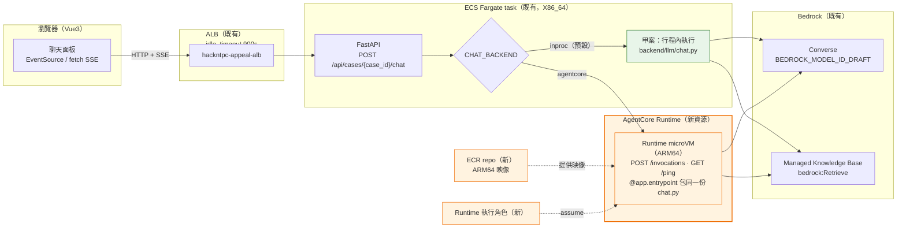

# 乙案架構設計：把聊天 agent 託管到 Bedrock AgentCore Runtime（2026-09-12）

> **狀態：Stretch，預設關閉，時間有剩才做。**
> 甲案（FastAPI 內建 Strands agent，`backend/llm/chat.py`）是已拍板的主線；本文件描述的乙案
> **不改變主線任何交付條件**，它只是把同一份 agent 模組換一個託管層跑。
> 開關 `CHAT_BACKEND` 預設 `inproc`，不設定就等於乙案不存在。
>
> 本文件**不推翻** `docs/spec/2026-09-07-bedrock-live-nodes-design.md:51`（D3：AgentCore 維持 Stretch）
> 與 `docs/spec/prototype-spec.md:86-89`（「AgentCore 是加分不是地基」）。正面回應見 §1.3。

---

## 1. 目標與非目標

### 1.1 目標

| # | 目標 | 怎麼算達成 |
|---|---|---|
| G1 | 同一份 `backend/llm/chat.py` 能在兩種託管層下跑：FastAPI 行程內、AgentCore Runtime | 兩種模式下**事件型別的出現順序**（依 `chat-honesty-lamps.md` §4.7 的事件序保證）**與 `done` 欄位集合相同**。⚠️ **多輪記憶行為不保證相同**——`agentcore` 模式的 session dict 在 Runtime microVM 裡，受 §9 R6 的 8 小時／15 分鐘限制，待實測 |
| G2 | 前端呼叫路徑不變 | 前端永遠只打 `POST /api/cases/{case_id}/chat`，不知道背後是哪一種 |
| G3 | 可插拔、可即時回滾 | 改一個環境變數 + 重新部署，10 分鐘內回到甲案 |
| G4 | 對評審可說明「用了 AgentCore」而不需要把地基押上去 | 地基是 Bedrock + Strands；AgentCore 是可插拔託管層 |

### 1.2 非目標（明確不做）

- **不做 AgentCore Gateway**。Gateway 是把 REST/OpenAPI 轉成 MCP tools 的轉接層；我們的 tools 是
  行程內的 Python 函式（包 `backend/retrieval/lawtable.py` 與 `backend/retrieval/kb.py`），
  直接打包進 Runtime 容器即可。引入 Gateway 會多一組 inbound auth 設定與已知的 tool cache 坑（§9 R5）。
- **不做 AgentCore Memory**。session 記憶維持甲案的 in-process dict 做法。
- **不做前端直連 Runtime**。前端直連要處理 CORS 與 SigV4 簽章，repo 目前零相關設施；一律經 FastAPI proxy。
- **不把六節點（N1–N6）搬上 Runtime**。只有聊天 agent。編排層仍是 `backend/orchestrator/graph.py` 的自寫 state machine。
- **不改規則引擎**。CONSTITUTION §4「規則引擎零 LLM」不受影響——聊天 agent 本來就不得計算期限
  （偵測規則在 `docs/spec/2026-09-12-chat-honesty-lamps.md` §3.2「數字類問題怎麼偵測」，§4.5 只定義 `redirect` 的 payload 形狀）。

### 1.3 正面回應「既有立場說 AgentCore 是 Stretch」

9/7 的 D3 與 prototype-spec 的立場是對的，本文件不推翻，理由如下：

| 當時的顧慮 | 現在的狀況 | 結論 |
|---|---|---|
| 「AgentCore 是加分不是地基」 | 本設計把它做成 `CHAT_BACKEND` 開關，預設關閉 | 立場**不變**，而且被本設計強化 |
| 「30h 內 agent 間編排＝除錯地獄」 | 本設計是**單一 agent 換託管層**，不是 agent 呼叫 agent | 顧慮不適用 |
| 「ARM64 ＋ 自訂 HTTP contract 是額外複雜度」（`docs/architecture.md:929-933`） | 仍然成立，是本案的主要成本（§9 R1、R2） | 因此維持 Stretch，不排進必做 |
| `docs/architecture.md:948-949`（§9.2 原文）的區域分析說只有東京／新加坡有 | 已被官方區域表推翻：us-west-2 支援本案會用到的全部元件——Runtime microVMs／Memory／Gateway／Identity／Observability／Policy／Evaluations（`docs/research/2026-09-12-agentcore.md` §2）。**只有 payments 是 No**（本案用不到，見 `docs/architecture.md:942`） | **這條顧慮消失**，是本文件存在的唯一新事實 |

**一句話**：唯一改變的是「us-west-2 做不做得到」從「疑慮」變成「可以」，
其他每一條反對理由都還在，所以它還是 Stretch。

---

## 2. 架構圖



**橘色 = 新資源**（AgentCore Runtime、ARM64 ECR repo、Runtime 執行角色）。
**綠色 = 甲案路徑**，永遠保留，是回滾目標。其餘全部是既有資源，本案不動。

新增資源清單（共三項 + 一項條件性）。**一律掛 `hackntpc-appeal` 前綴**，理由同既有 stack
（`infra/cdk/lib/appeal-backend-stack.ts` 的 `const PREFIX`：這個帳號是共用的，不掛前綴認不出來）：

| 資源 | 為什麼要 | 刪得掉嗎 |
|---|---|---|
| AgentCore Runtime | 託管 agent 的執行環境 | 是（`cdk destroy` 或 CLI 刪） |
| ECR repository（ARM64 映像專用） | Runtime 只吃容器映像 | 是 |
| Runtime 執行角色（IAM Role） | Runtime 呼叫 Bedrock / 寫 log 用 | 是 |
| CodeBuild 執行角色（**只在走 `agentcore launch` 路線時**） | CLI 用 CodeBuild 建 ARM64 映像 | 是 |

---

## 3. 部署方式：二選一與選定

### 3.1 兩條路線

| | 路線 A：CDK 併入現有 stack（用 L2 `Runtime`） | 路線 B：`agentcore launch` 獨立管線 |
|---|---|---|
| 工具 | `aws-cdk-lib/aws-bedrockagentcore`——**2026-09-12 實跑確認 TypeScript 端有 L2 `Runtime` class**，不只 research §3 查到的 L1 | `bedrock-agentcore-starter-toolkit` 的 `agentcore` CLI（`docs/research/2026-09-12-agentcore.md` §3） |
| 建置 ARM64 映像 | 自己 `docker buildx` 或 CDK asset | CLI 自動用 **AWS CodeBuild** 建置推 ECR |
| 資源生命週期 | 跟 `hackntpc-appeal-backend` stack 綁一起 | 獨立於 CDK 之外，`cdk destroy` 碰不到 |
| 回滾 | `git revert` + `deploy.sh deploy` | 要手動刪 Runtime／ECR／角色 |
| 已知坑 | `aws/aws-cdk#35852`（<https://github.com/aws/aws-cdk/issues/35852>）：custom execution role policy 權限模板不足，要自己補（`docs/research/2026-09-12-agentcore.md` §3） | 自動建的 CodeBuild role **預設缺 ECR 權限**，第一次 launch 常炸（`docs/research/2026-09-12-agentcore.md` §3、§7-1） |
| 我們的 stack 相容性 | ⚠️ 現有 stack 是 **TypeScript**（`infra/cdk/lib/appeal-backend-stack.ts`），`docs/research/2026-09-12-agentcore.md` §3 查到的 L1 module 是 **Python** 版文件 | 與語言無關 |

### 3.2 選定：**路線 A（CDK 併入現有 stack；2026-09-12 查證後改用 L2 `Runtime`）**

理由，依重要性排序：

1. **回滾成本是本案唯一真正的風險**（§8）。路線 A 的回滾是 `git revert` + 一次 `deploy.sh deploy`，
   跟現在換版流程完全一樣；路線 B 要手動追著刪三、四個散落資源，而評審日只有一次機會。
2. **`infra/cdk/deploy.sh:38-40`（profile／region）與 `:53-55`、`:64`（toolkit stack 名）已經把這些鎖死**，
   路線 A 直接繼承這些保護；路線 B 得在 `agentcore configure` 再指定一次 region
   （`docs/research/2026-09-12-agentcore.md` §7-6 記錄過 region 手誤直接報 unrecognized region）。
3. **路線 B 的第一個已知坑（CodeBuild 缺 ECR 權限）發生在「第一次執行」**，
   也就是最沒有時間除錯的那一刻。路線 A 的已知坑（#35852 role policy）是**部署時 synth 就看得到的
   policy 內容**，可以先寫對再送。

**選 A 的前提已於 2026-09-12 實跑查證成立**（原 §10 T1，已結案）：

```bash
cd infra/cdk && npm ci
ls node_modules/aws-cdk-lib | grep -i agentcore   # → aws-bedrockagentcore
```

`aws-cdk-lib@2.269.0` 的 TypeScript 端**有** `aws-cdk-lib/aws-bedrockagentcore`，而且不只 L1：

| 層 | 有什麼 | 對本案的意義 |
|---|---|---|
| L1 | `CfnRuntime`、`CfnRuntimeEndpoint`、`CfnGateway`、`CfnMemory` 等 | 降級路徑（`CfnResource`）不必動用 |
| **L2** | `Runtime` class（該套件的 lib/runtime/runtime.d.ts），含 `executionRole?`、`agentRuntimeArtifact`、`environmentVariables`、`protocolConfiguration` | **可以直接用，不必手拼 L1 props** |
| L2 的 grant helper | `grantInvokeRuntime()`／`grantInvoke()`／`grantInvokeRuntimeForUser()` | 呼叫端的 IAM statement 由它產生，不必自己寫 action 名與 ARN（見 §6.1） |

**降級路徑保留但不再是計畫的一部分**：若 L2 用起來卡住，退回 L1 `CfnRuntime`；再不行才放棄乙案。
**不改走路線 B**——路線 B 的回滾成本就是當初排除它的理由。

> **曾與甲案 S7 衝突，已解，無須拍板。** 甲案兩份原本把 stretch 做法寫成 `agentcore launch`
> （＝路線 B），已於 2026-09-12 改為指向本計畫（甲案 plan 的 S7 與該 change 的 proposal）。
> 現在只有一條路線：路線 A。保留這段紀錄是因為「兩份文件對同一件事給相反做法」這個風險本身值得記著。

### 3.3 `aws-cdk#35852` 的補法

已知缺口：CDK 對 Runtime 的 custom execution role 權限模板不足（`aws/aws-cdk#35852`，`docs/research/2026-09-12-agentcore.md` §3）。**這個缺口跟用 L1 還是 L2 無關**，所以 T1 結案不解除它。
**不依賴任何自動產生的 policy**，Runtime 執行角色一律自己手刻（§6.2），並在部署前用
`npx cdk synth` 把 policy 印出來人工對一次。這跟現有 stack 對 `taskRole` 的做法一致
（`infra/cdk/lib/appeal-backend-stack.ts` 的 `new iam.Role(this, 'TaskRole', …)` 與它後面兩條 `addToPolicy` 全部手寫，沒有用任何 grant helper）。

---

## 4. Runtime 容器合約與第二個 Dockerfile

### 4.1 硬性合約

Runtime 的 HTTP protocol contract（`docs/architecture.md:930-931` 已載明，來源為官方
[HTTP protocol contract](https://docs.aws.amazon.com/bedrock-agentcore/latest/devguide/runtime-http-protocol-contract.html)；
`docs/research/2026-09-12-agentcore.md` §7-2 重複確認）：

| 項目 | 值 | 不符合的後果 |
|---|---|---|
| CPU 架構 | **ARM64** | 部署失敗 |
| 監聽 | `0.0.0.0`，**Port 8080** | 部署失敗 |
| 必要端點 | `POST /invocations`、`GET /ping` | 部署失敗 |
| agent 入口 | `@app.entrypoint` 包住 Strands agent | — |

> 註：`backend/Dockerfile` 與 `backend/api/app.py` 這輪正被其他工作包同時修改，
> 本文件對這兩個檔**刻意用內容錨點（COPY 行、函式名）而不是行號**——行號會漂。

### 4.2 為什麼不能沿用 `backend/Dockerfile`

`backend/Dockerfile` 是給 ECS 用的：

- 它建的是 **X86_64**（`infra/cdk/lib/appeal-backend-stack.ts` 的
  `ecr_assets.Platform.LINUX_AMD64` 與 `ecs.CpuArchitecture.X86_64`），Runtime 要 ARM64；
- 它的 `CMD` 起的是 `uvicorn backend.api.app:app`（`backend/Dockerfile` 末行的 `CMD`），
  跑的是整個 FastAPI（八個 endpoint、前端靜態檔、健康檢查），Runtime 只需要 agent；
- 它 `COPY frontend/dist/` 與 `COPY data/manifest.json`（同檔，搜這兩行），Runtime 兩者都不需要。

### 4.3 第二個 Dockerfile：路徑與內容

**路徑：`backend/Dockerfile.agentcore`**（與現有 Dockerfile 同目錄、同建置 context＝repo 根目錄）。

```
FROM --platform=linux/arm64 python:3.12-slim
# 只裝 agent 需要的：boto3 / strands-agents / bedrock-agentcore（SDK）
COPY backend/requirements.txt ...
COPY backend/llm/    /app/backend/llm/
COPY backend/retrieval/  /app/backend/retrieval/
COPY backend/config/ /app/backend/config/
# 入口：backend/agentcore_entry.py（新檔）
#   from bedrock_agentcore import BedrockAgentCoreApp
#   app = BedrockAgentCoreApp()
#   @app.entrypoint  →  呼叫 backend/llm/chat.py 的 build_chat_agent()
EXPOSE 8080
CMD ["python", "-m", "backend.agentcore_entry"]
```

> 以上是形狀，不是最終程式碼。`bedrock-agentcore` SDK 的實際 import 名稱與
> `BedrockAgentCoreApp` 的確切 API 標**待查**（§10 T2）。

**建置 context 的 exclude 必須同步**：`infra/cdk/lib/appeal-backend-stack.ts` 的 `ecs.ContainerImage.fromAsset` 的 `exclude` 清單
同時決定「什麼能被 COPY」與「映像檔 hash 怎麼算」，兩邊不對齊不會報錯只會默默少東西
（`.prospec/changes/deploy-backend-to-aws/proposal.md:163` 記錄已踩過兩次）。
ARM64 asset 若用 CDK `fromAsset`，要給它**自己的一份 exclude**，或沿用同一份。
順帶：現有 exclude 仍寫 `prototype/static`、`prototype/node_modules`（`:139-140`），
但前端目錄已改為 `frontend/`（見 `backend/Dockerfile` 的 `COPY frontend/dist/`）——**這是既有的過時項，本案不修，但新 asset 不要照抄**。

### 4.4 `chat.py` 的模組契約（甲乙共用的那條線）

`backend/llm/chat.py` 必須是**純 agent 模組，不依賴 FastAPI**（這是甲案就定好的，見 `plans/2026-09-12-chat-ask-agent.md` 的 S2／S4／S5 分層）。具體要求：

- 對外暴露 `build_chat_agent()`（簽名以甲案實作為準），**以及甲案定義的純函式層
  `RefBook`／`NUMERIC_Q`／`classify_answer()`**（`plans/2026-09-12-chat-ask-agent.md` S2）；
- 不 import `fastapi`、不 import `backend.api.*`；
- 五個 tool 沿用甲案的名稱：`search_regulations`／`search_similar_decisions`／
  `retrieve_refs`／`read_case`／`refine_text`（`docs/spec/2026-09-12-chat-honesty-lamps.md` §4.0 工具清單）；
- SSE 事件的產生（`tool_call`／`tool_result`／`token`／`done`／`error`）由**呼叫端**負責格式化，
  `chat.py` 只吐 Strands 的原生串流事件。

**燈號在哪裡算（這條不寫清楚，乙案一啟用就會掉燈）**：
`inproc` 模式由 `backend/api/chat.py` 呼叫 `classify_answer()`；
`agentcore` 模式**由 Runtime 內的 `backend/agentcore_entry.py` 呼叫 `classify_answer()`**，
在 Runtime 裡就把 `done` 組好再吐出來。FastAPI proxy 只做 bytes 轉送、不重組、不補算（**唯一例外見 §5 的 `?stream=0`**，那條必須聚合）。
兩種模式的 `done` 欄位集合必須與 `docs/spec/2026-09-12-chat-honesty-lamps.md` §4.4 **逐欄相同**
（`seq`／`turn_id`／`session_id`／`answer`／`lamp`／`tier`／`origin`／`why`／`refs`／
`dropped_refs`／`redirect`／`refine_used`／`memory`／`session_truncated`／`model_id`／`elapsed_ms`）。
CONSTITUTION §1／§2。

**`/invocations` 的 payload 必須夾帶已組好的 case payload 分區——Runtime 不自己讀 runstore。**
這條是 `read_case` 這個 tool 能不能在 Runtime 裡運作的關鍵，不寫清楚它**必然壞掉**：

- `build_payload()` 在 `backend/orchestrator/graph.py` 的 `build_payload(state)`，吃的是 `CaseState`；
- `CaseState` 由 runstore 從 **ECS task 的本機檔案** `backend/output/runs/{run_id}.json` 讀出；
- Runtime 是另一個 microVM，**沒有那個檔**；而且 `Dockerfile.agentcore` 只 COPY
  `backend/llm/`、`backend/retrieval/`、`backend/config/`，`backend/orchestrator/` 根本不在映像裡。

所以契約是：**payload 分區由 HTTP 層（`backend/api/chat.py`）先讀好、當參數餵進 agent**，
`chat.py` 與 `agentcore_entry.py` 都完全不碰 runstore。甲案已依此調整，乙案沿用同一個契約——
這也是為什麼 `Dockerfile.agentcore` 不需要 COPY `backend/orchestrator/`。

**這一條是乙案能成立的全部前提**。`chat.py` 一旦 import 了 FastAPI、或 `agentcore_entry.py`
一旦想自己讀 runstore，乙案就得改程式碼而不是換託管層——那就不是可插拔了。

---

## 5. 串流

```
Bedrock Converse stream
   → Strands agent 事件
   → Runtime 以 SSE 回應（Content-Type: text/event-stream，`docs/research/2026-09-12-agentcore.md` §4）
   → FastAPI proxy 逐塊轉送（不緩衝、不重組）
   → 前端 EventSource / fetch
```

要點：

- `InvokeAgentRuntime` 設 `Content-Type: text/event-stream` 即以 SSE 回傳
  `data: {"event": ...}`（`docs/research/2026-09-12-agentcore.md` §4，來源為官方 CLI reference 與 runtime-invoke-agent 文件）。
- FastAPI proxy **照抄 `backend/api/app.py` 的 `run_events()`（`@app.get("/api/runs/{run_id}/events")`）既有的同步 `def` + threadpool 模式**，
  並保留 `X-Accel-Buffering: no` header（甲案已這麼做）。
- **事件格式不因託管層改變**：`tool_call`／`tool_result`／`token`／`done`／`error`，
  `done` 的欄位集合與 `docs/spec/2026-09-12-chat-honesty-lamps.md` §4.4 **逐欄相同**（撰寫時 2026-09-12 是 16 個 key，**以該 spec 當下內容為準**），
  不是只帶 `lamp`／`tier`／`origin`／`refs[]`（詳 §4.4 的「燈號在哪裡算」）。本文件不自行定義燈號規則。

**`?stream=0` 是「proxy 不重組」原則的具名例外（必須做，否則會弄壞甲案一條已驗綠的 AC）**：

`chat-honesty-lamps.md` §2.2 把 `?stream=0` 定為凍結契約——回 `application/json`，
body 是 `done` 物件再加一個 `events[]`（本來會逐筆發出的 `tool_call`／`tool_result`／`token`）。
它是前端硬性驗收項，也是「賽場網路讓 SSE 斷流」時**唯一**的降級路徑
（前端連兩次收不到 `done` 就切過來，而不是用 CSS 演一段沒發生的串流）。

§4.4 的「proxy 只做 bytes 轉送、不重組」是為串流路徑寫的。`?stream=0` 走不通那條：
它必須**收齊 Runtime 吐的所有事件、重組成單一 JSON**。所以：

- `CHAT_BACKEND=agentcore` 且帶 `?stream=0` → **proxy 負責聚合**，形狀與 inproc 模式逐欄相同；
- 這是唯一被允許的重組，不得擴大到串流路徑；
- 不做這段的後果：**開一個 Stretch 開關就讓主線一條已驗綠的 AC 失效**，那比乙案本身的價值大得多。

- ALB idle timeout 已是 `infra/cdk/lib/appeal-backend-stack.ts` 的
  `service.loadBalancer.setAttribute('idle_timeout.timeout_seconds', '900')`，
  長連線無需再動——**這是甲案已經付掉的成本，乙案免費繼承**。
- proxy 多一跳，端到端延遲會增加（冷啟動見 §9 R4）。

---

## 6. IAM

### 6.1 ECS taskRole 要新增的 action

現有 taskRole 只有兩條 statement（`infra/cdk/lib/appeal-backend-stack.ts` 的 `sid: 'InvokeNamedModelsOnly'` 與 `sid: 'RetrieveFromOneKnowledgeBaseOnly'`）：
`bedrock:InvokeModel`／`InvokeModelWithResponseStream` 與 `bedrock:Retrieve`。
乙案要新增第三條，讓 FastAPI 能呼叫 Runtime：

**用 L2 的 grant helper，不要自己拼 ARN**（2026-09-12 實跑確認 L2 存在）：

```ts
// runtime 是 L2 的 aws_bedrockagentcore.Runtime 實例
runtime.grantInvokeRuntime(taskRole);
```

它產生的 action 就是 `bedrock-agentcore:InvokeAgentRuntime`
（aws-cdk-lib 的 `aws-bedrockagentcore/lib/runtime/perms.js`（`npm ci` 後在 `infra/cdk/node_modules/` 底下，不在 git 裡） 的 `RUNTIME_INVOKE_PERMS`），
resource 也由 L2 填上自己的 ARN——**不必自己拼、不會拼錯**。

> §3.3 說「所有角色手刻、不信任自動產生的 policy」，那是針對 **Runtime 執行角色**
> （`aws/aws-cdk#35852` 回報的是 execution role 的模板）。`grantInvokeRuntime` 是給**呼叫端**
> 加一條白名單 statement，跟那個缺口是兩回事，而且 `cdk synth` 看得到它產生了什麼。兩者不衝突。

**action 名稱已於 2026-09-12 實跑查證**：aws-cdk-lib 的 `aws-bedrockagentcore/lib/runtime/perms.js`（`npm ci` 後在 `infra/cdk/node_modules/` 底下，不在 git 裡）
的 `RUNTIME_INVOKE_PERMS = ["bedrock-agentcore:InvokeAgentRuntime"]`。原本的推論是對的，現在有出處。
**但仍然不要自己寫這條**——用上面的 grant helper，讓 CDK 連 ARN 一起填。

### 6.2 Runtime 執行角色（最小權限）

手刻，不用任何自動產生的 policy（§3.3）：

| 權限 | 資源範圍 | 為什麼 |
|---|---|---|
| `bedrock:InvokeModel`、`bedrock:InvokeModelWithResponseStream` | **只給 `BEDROCK_MODEL_ID_DRAFT` 那一顆**的 ARN 組（沿用 `appeal-backend-stack.ts` 的 `invokeArnsFor()`） | 聊天沿用 draft 模型，不引入第三顆 |
| `bedrock:Retrieve` | 只給 `BEDROCK_KB_ID` 那一個 KB 的 ARN（同 `:94-102`） | 與 taskRole 同範圍 |
| `logs:CreateLogGroup`、`logs:DescribeLogStreams` | 該 Runtime 自己的 log group | **原本漏了這兩個**。依 `perms.js` 的 `RUNTIME_LOGS_GROUP_ACTIONS`，Runtime 要能自己建 log group |
| `logs:DescribeLogGroups` | log group 清單 | 依 `RUNTIME_LOGS_DESCRIBE_ACTIONS`。這個 action 通常需要較寬的 resource，`cdk synth` 後人工核 |
| `logs:CreateLogStream`、`logs:PutLogEvents` | 該 Runtime 自己的 log group | 依 `RUNTIME_LOGS_STREAM_ACTIONS`。除錯用 |
| `ecr:BatchGetImage`、`ecr:GetDownloadUrlForLayer` | 新建的那一個 ECR repo | 拉映像。與 `perms.js` 的 `RUNTIME_ECR_IMAGE_ACTIONS` 一字不差 |
| `ecr:GetAuthorizationToken` | **只能 `Resource: "*"`** | AWS 對這個 action **明文不支援資源層級限定**；寫成 repo ARN 的話 Runtime 拉不到映像。這是唯一的例外，驗收條件要把它排除掉（見下）。**官方 CDK 也把它單獨拆成 `RUNTIME_ECR_TOKEN_ACTIONS`**（與 image actions 分開），這是 B9 判斷正確的獨立佐證 |

> `invokeArnsFor()` 的跨區 inference profile 雙 ARN 規則（見該函式上方的說明註解）
> **對 Runtime 執行角色同樣適用**——少給 foundation-model 那一條會 AccessDenied。直接重用該函式。

**不給的**：`bedrock:*`、`s3:*`。除 `ecr:GetAuthorizationToken` 之外**不得有 `Resource: "*"`**。CONSTITUTION §7。

> ⚠️ **`cdk synth | grep 'Resource: "*"'` 不能無限定地用。** 現有 stack 用
> `ApplicationLoadBalancedFargateService`，CDK 自動建的 task execution role 本來就帶
> `AmazonECSTaskExecutionRolePolicy`（內含 `ecr:GetAuthorizationToken` on `*`），
> 所以那個 grep **在動手之前就已經有既存命中**。人工核的時候要先把既存命中列出來當基線，
> 只看本 change 新增的 statement——否則會被雜訊淹掉，變成一條看起來有做、實際看不出東西的檢查。

---

## 7. 開關設計

```
CHAT_BACKEND = inproc | agentcore     預設 inproc
AGENTCORE_RUNTIME_ARN = <arn>          僅 CHAT_BACKEND=agentcore 時需要
```

| 位置 | 做法 |
|---|---|
| `backend/config/settings.py` | 加 `chat_backend: str = "inproc"`、`agentcore_runtime_arn: str \| None = None` |
| `backend/api/chat.py` | 依 `settings.chat_backend` 分派：`inproc` → 直接跑 `build_chat_agent()`；`agentcore` → `boto3` 呼叫 `InvokeAgentRuntime` 並轉送 SSE |
| task definition | `infra/cdk/lib/appeal-backend-stack.ts` 的 `taskImageOptions.environment` 加兩個 key。**task definition 是「跑哪個檔位」的唯一事實來源**（既有原則，`.prospec/changes/deploy-backend-to-aws/proposal.md:69-76` US-4） |
| `/api/health` | 加一項 `chat_backend`，讓「以為在跑 AgentCore、其實是 inproc」抓得到。CONSTITUTION §1 |

**fail-safe 方向**：`CHAT_BACKEND` 沒設或值不認得 → 走 `inproc`。
設成 `agentcore` 但 `AGENTCORE_RUNTIME_ARN` 缺 → **啟動時就報錯**，不要靜默退回 inproc。

> 理由不是「靜默 fallback 一律有害」。`.prospec/changes/deploy-backend-to-aws/proposal.md:112`
> 對「忘記給 `RUN_MODE`」的立場其實是**贊成** fallback——退回 fixture 是 fail-safe（不會偷打模型），
> 而且 `/api/health` 的 `fixture_only=true` 會讓驗收失敗、抓得到。那條支持本節前半
> （`chat_backend` 值不認得就走 `inproc`），**不支持**後半。
>
> 後半的理由是另一件事：`CHAT_BACKEND=agentcore` 是一個**明確的意圖宣告**，缺 ARN 是設定殘缺。
> 這種情況退回 inproc 不是 fail-safe，是**把一個寫錯的設定當成沒寫**——部署的人以為在跑
> Runtime，`/api/health` 雖然會誠實說 `inproc`，但沒人會去看它，因為他相信自己設好了。
> 啟動即失敗是唯一會被注意到的訊號。

---

## 8. 回滾步驟（目標 10 分鐘內）

情境：乙案上線後出問題，要回到甲案。

| # | 動作 | 時間 |
|---|---|---|
| 1 | 把 task definition 的 `CHAT_BACKEND` 改回 `inproc`（改 `appeal-backend-stack.ts` 一行） | 1 分 |
| 2 | `infra/cdk/deploy.sh deploy`（改設定不重建映像檔，既有流程約 4 分鐘，見 `.prospec/changes/deploy-backend-to-aws/proposal.md:162`） | 4 分 |
| 3 | `infra/cdk/verify.sh` 跑一次，全綠。甲案完成後 `verify.sh` 是**五段有標號的檢查**（首頁是 UI／檔位四項／Bedrock 連通／守門 409／chat SSE）**外加一段未標號的資料隔離檢查**。注意「檔位四項」是第 2 段**一段**，不是四段 | 3 分 |
| 4 | 前端不需要任何改動（呼叫路徑沒變） | 0 分 |

**Runtime 資源可以先不刪**——它不在請求路徑上就不影響 demo。
這正是選路線 A 的好處：Runtime 是同一個 stack 的一部分，不會變成沒人記得刪的孤兒。

> ⚠️ **交件夜不要對這個 stack 下 `cdk destroy`。** 它會拆掉整個
> `hackntpc-appeal-backend`——ECS service、ALB、評審在用的那個網址全部一起消失。
> 回滾就是「`CHAT_BACKEND` 改回 `inproc` → 重新 deploy → 資源留著不刪」，到此為止。
> 真要清掉乙案新增的資源，是**把那幾個 construct 從 stack 程式碼移除後再 deploy**
> （CloudFormation 會只刪掉消失的資源），不是 destroy 整個 stack。賽後收攤才用 destroy。

### 8.1 Runtime 失敗時回什麼（分開流前與開流後，**不重用 502**）

不自動退回 inproc——延續 D5（`docs/spec/2026-09-07-bedrock-live-nodes-design.md:53` 那張表）
「live 失敗不自動退回 fixture」的精神。自動 fallback 會讓失敗的執行假裝成成功。
但「回什麼」要分兩種情況，混在一起會撞既有契約：

| 何時 | 回什麼 | 為什麼不是 502 |
|---|---|---|
| **開流前**（`InvokeAgentRuntime` 就打不通：Runtime 不存在／不健康／權限錯／冷啟動逾時） | **503**，body 比照 `chat-honesty-lamps.md` §2.3 的 503 形狀，`why` 說明是託管層不可用，並註明「切 `CHAT_BACKEND=inproc` 即恢復」 | §2.3 已把 **502 定義成「該 run 是失敗的」**，body 是 `{run_id, status:"failed", node, error}`。回一個形狀不同的 502，前端會把「託管層掛了」誤讀成「案子跑失敗」，去顯示一個不存在的失敗節點 |
| **開流後**（header 已送出才斷：throttle、microVM 回收、session 逾時、ALB 900 秒切斷） | 發一個 **`error` 事件**後關流，`stage` 用 `transport` | header 早已送出，**回不了任何狀態碼**。而 `chat-honesty-lamps.md` §2.3 的紅線是「拿到 `text/event-stream` 就一定至少有一個 `done` 或 `error`」——不發 `error` 就直接違反那條紅線 |

> `stage` 的 `transport` 值由 `chat-honesty-lamps.md` §4.6 定義（甲案 2026-09-12 加入，
> 那是給前端的契約變更）。**乙案直接依用，不自行造值。**
> 若該值當下還不在 `chat-honesty-lamps.md` §4.6 的值域裡，**停下來問，不要自己挑一個看起來合理的**——
> 規格裡任何「找不到就自己想一個」的授權，最後都會變成編造。CONSTITUTION §1。

前端看到的差別：開流前是一個 JSON 錯誤、對話泡不會出現；開流後是對話泡已經在了，
末尾接一個紅色的傳輸中斷訊息。**兩種都不得演成「回答完成」。**

---

## 9. 風險與已知坑

| # | 風險 | 證據 | 緩解 |
|---|---|---|---|
| R1 | ARM64 映像是第二條建置管線，Apple Silicon 上要 `buildx`，CI 沒有 | `appeal-backend-stack.ts` 的 `ecs.ContainerImage.fromAsset` 上方註解記錄「忘記釘 platform 是第一次部署最常見的失敗原因」 | 本機先 `docker run --platform linux/arm64` 跑起來、打一次 `/ping` 再推 |
| R2 | 路線 B 的 CodeBuild 角色預設缺 ECR 權限，第一次 `launch` 會炸 | `docs/research/2026-09-12-agentcore.md` §3、§7-1 | 已選路線 A，不觸發 |
| R3 | CDK 的 execution role policy 模板不足（`aws/aws-cdk#35852`；L1／L2 皆然） | `docs/research/2026-09-12-agentcore.md` §3 | 角色全手刻 + `cdk synth` 人工核 policy（§3.3） |
| R4 | **冷啟動**：現場 demo 第一次呼叫可能明顯慢 | `docs/research/2026-09-12-agentcore.md` §7-4（官方與社群都建議預熱） | 上台前手動打一次 `/invocations` 熱機；同一 session 內重複呼叫會重用熱機環境（`docs/research/2026-09-12-agentcore.md` §7-3） |
| R5 | Gateway 改動後 Runtime 吃到舊 tool 定義（MCP client cache） | `docs/research/2026-09-12-agentcore.md` §7-5 | **不做 Gateway**（§1.2），此坑不適用 |
| R6 | session 生命週期上限 8 小時、閒置 15 分鐘回收 | `docs/research/2026-09-12-agentcore.md` §7-3 | demo 用不到長 session；但 `session_id` 的產生與失效要在 proxy 端處理，不能假設永久 |
| R7 | 多一跳 proxy，SSE 中斷點變多（ALB → FastAPI → Runtime） | — | `verify.sh` 加一條 `curl -N` 打 chat 端點收到 `done`（甲案 `plans/2026-09-12-chat-ask-agent.md` 已排入 verify.sh 第 5 段） |
| ~~R8~~ | ~~TypeScript CDK 模組可能不存在於 2.269.0~~ | **已排除（2026-09-12 實跑 `npm ci`）**：模組存在，且有 L2 `Runtime` 與 grant helper（見 §10 T1） | 殘餘風險降為「L2 用起來卡住」，退路是 L1 `CfnRuntime`；§3.2 的降級路徑備而不用 |
| R9 | 成本 | Runtime $0.0895/vCPU-小時 + $0.00945/GB-小時，I/O wait 不計 CPU（`docs/research/2026-09-12-agentcore.md` §6） | demo 量級是幾美元等級，不是決策點 |
| R10 | **`read_case` 在 Runtime 裡拿不到資料。** `build_payload()` 在 `backend/orchestrator/graph.py`，吃的 `CaseState` 由 runstore 從 ECS task 本機檔讀出；Runtime 是另一個 microVM，映像裡也沒有 `backend/orchestrator/` | 實查：`grep -rn "def build_payload" backend/` 只命中 `backend/orchestrator/graph.py`；`Dockerfile.agentcore` 的 COPY 清單只有 `llm/`／`retrieval/`／`config/` | §4.4 的 payload 契約：分區由 HTTP 層先讀好夾帶進 `/invocations`，Runtime 不碰 runstore。**這條不做就是 ImportError，不是效能問題** |
| R11 | **釘住的 boto3 版本可能沒有要用的 client。** `backend/requirements.txt` 釘 `boto3~=1.35.0`（即 `<1.36`，2024-08 版本，早於 AgentCore 存在） | `boto3.client('bedrock-agentcore')` 會拋 `UnknownServiceError`，§6.1 的 proxy 一行都跑不起來 | §10 T7 先查；要放寬版本釘就得改 `requirements.txt`，那個檔在甲案 AC9 的觀察範圍內（見 §13） |

---

## 10. 待查清單（實作前必須核，不得憑推論寫進程式）

| # | 待查項 | 怎麼查 |
|---|---|---|
| ~~T1~~ | ~~TypeScript 端有沒有 `aws-bedrockagentcore`~~ | ✅ **已查證（2026-09-12 實跑）**：`cd infra/cdk && npm ci && ls node_modules/aws-cdk-lib \| grep -i agentcore` → `aws-bedrockagentcore`。版本 `2.269.0`。**不只有 L1 `CfnRuntime`／`CfnRuntimeEndpoint`，還有 L2 `Runtime` class**（該套件的 lib/runtime/runtime.d.ts（`npm ci` 後在 `infra/cdk/node_modules/aws-cdk-lib/aws-bedrockagentcore/` 底下））。§3.2 的降級路徑不必動用，**路線 A 的前提成立** |
| T2 | `bedrock-agentcore` Python SDK 的 import 名稱與 `@app.entrypoint` 確切 API | 官方 starter toolkit 文件／`pip show bedrock-agentcore` |
| ~~T3~~ | ~~`bedrock-agentcore:InvokeAgentRuntime` action 名稱~~ | ✅ **已查證（2026-09-12 實跑）**：aws-cdk-lib 的 `aws-bedrockagentcore/lib/runtime/perms.js`（`npm ci` 後在 `infra/cdk/node_modules/` 底下，不在 git 裡） 的 `RUNTIME_INVOKE_PERMS = ["bedrock-agentcore:InvokeAgentRuntime"]`。**原本的推論是對的**，但現在有出處了。**更好的做法是不要自己寫這條 statement**：L2 `Runtime` 有 `grantInvokeRuntime(grantee)`，讓它產生即可（見 §6.1）。ARN 形狀也由 L2 產生，不必自己拼 |
| T4 | 乙案從零到能被 HTTP 呼叫的實際時數 | **查不到官方或社群數字**（`docs/research/2026-09-12-agentcore.md` §7）。§12 的時數是推論，不是查證值 |
| T5 | 賽方規則原文對「僅限 AWS 服務提供之基礎模型」的措辭 | 對照賽方文件（§11） |
| T6 | **`InvokeAgentRuntime` 設 `Content-Type: text/event-stream` 是否即以 SSE 回傳 `data: {...}`** | 出處是 `docs/research/2026-09-12-agentcore.md` §4（讀自官方 CLI reference 與 runtime-invoke-agent 文件，**但本團隊未實測**）。**這條是整個串流設計的地基，比 T3 更載重**，實作前直接試打一次確認 |
| T7 | **`backend/requirements.txt` 釘 `boto3~=1.35.0`（即 `<1.36`，2024-08 版本，早於 AgentCore 存在），這個版本有沒有 `bedrock-agentcore` client** | `pip download 'boto3~=1.35.0'` 後試 `boto3.client('bedrock-agentcore')`。**沒有就會拋 `UnknownServiceError`**，§6.1 那段 proxy 程式碼一行都跑不起來。要放寬版本釘就得改 `requirements.txt`，而那個檔在甲案 AC9 的觀察範圍內（見 §13），改動要跟甲案對齊 |

---

## 11. 賽制合規

**事實（`docs/research/2026-09-12-agentcore.md` §8，只列查到的）**：

- AgentCore 官方定位是**編排／執行層**（Runtime 是執行環境、Gateway 是工具轉接層），
  **它本身不是基礎模型**；模型仍是透過 Bedrock 呼叫 Bedrock 目錄內的模型。
- AWS AI Agent Global Hackathon 官方頁把 AgentCore 與 Bedrock、Q、SageMaker 並列為「可選用的 AWS AI 服務」。
- **沒有查到任何說法指出 AgentCore 會被當成「非 AWS 提供的模型」。**

**限制（照實說）**：以上來自通用 AWS 文件，**不是新北市法制局賽制的原文**。
本案要用乙案之前，Ci 需對照賽方規則原文確認（§10 T5）。
本設計不因此卡住——乙案本來就預設關閉，甲案（純 Bedrock + Strands）在任何解讀下都合規。

---

## 12. 預估時數（推論，非查證值）

| 階段 | 時數 |
|---|---|
| 待查項查證（T1／T3 已於 2026-09-12 結案，剩 T2／T6／T7） | 0.3 h |
| `Dockerfile.agentcore` + `agentcore_entry.py` + 本機 ARM64 跑通 `/ping` | 1.5 h |
| CDK L2 `Runtime` + 執行角色 + `grantInvokeRuntime(taskRole)` | 1.5 h |
| `backend/api/chat.py` 的 agentcore 分派與 SSE 轉送 | 1 h |
| 部署 + 在 `agentcore` 檔位下跑一次甲案的 verify.sh 第 5 段 + 端到端驗 | 1 h |
| **合計** | **5.3 h** |

**這個數字是推論**。`docs/research/2026-09-12-agentcore.md` §7 明確記錄「查不到官方或社群給出的精確時數」，社群教學暗示小時級但
「這是推論不是查證到的事實」。**最遲放棄時刻與備援見 `plans/2026-09-12-agentcore-runtime-chat.md`。**

---

## 13. 相關文件

| 文件 | 關係 |
|---|---|
| `docs/spec/2026-09-07-bedrock-live-nodes-design.md:51`（D3） | 本文件**不推翻**，見 §1.3 |
| `docs/spec/prototype-spec.md:86-89` | 同上 |
| `docs/architecture.md:935-946`（§9.2 標題與新加註）／`:948-949`（過時原文） | 區域結論已過時，已就地加註，原文保留 |
| `docs/spec/2026-09-12-chat-honesty-lamps.md` | 事件與燈號契約的唯一真實來源，本文件不自行定義 |
| `plans/2026-09-12-chat-ask-agent.md`／`.prospec/changes/chat-ask-agent/` | **甲案**，本案的前提 |
| 甲案 AC9 | 甲案的 AC9 是 `git diff --stat $BASE_SHA...HEAD -- infra/ backend/requirements.txt backend/Dockerfile`（`$BASE_SHA` 在甲案 S0 記下）。乙案會動 `appeal-backend-stack.ts` 與 `backend/requirements.txt`，兩者都在它的觀察範圍內。**處置：AC9 在甲案完成時評估一次就定案，乙案（S7）開工後它不再適用，乙案有自己的驗收。不要回頭用 AC9 判 S7，也不要事後去改 AC9 的期望值**——基準釘在固定的 `$BASE_SHA` 才有意義，改期望值會讓它變成移動標靶，並毀掉它作為「甲案確實沒動部署」這個紀錄的價值。此處以甲案 `plans/2026-09-12-chat-ask-agent.md` 的寫法為準（2026-09-12 tech-lead 裁決） |
| `backlog.md` HACK-S-3 / HACK-S-4 | S-4「跑在 AgentCore Runtime 上」即本案；S-3（甲案聊天）是它的前提 |
| `.prospec/changes/agentcore-runtime-chat/` | proposal + plan |
| `plans/2026-09-12-agentcore-runtime-chat.md` | superpowers 格式計畫 |
